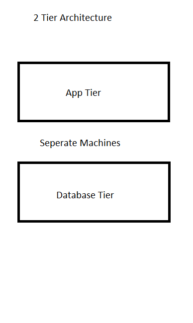

# Setting up a 2 Tier Architecture

### Monolithic Architecture

Monolithic architecture refers to a traditional software design approach where an entire application is built as a single, self-contained unit. In this architecture:

* Components: All the different functionalities of the application, such as user interface, business logic, and data access, are tightly integrated and deployed together.
  
* Communication: Components within the application typically communicate with each other through method calls or function invocations within the same memory space.
  
* Scalability: Scaling the application usually involves replicating the entire monolith, rather than scaling individual components independently.
  
* Deployment: The application is deployed as a single unit, making deployment simpler but potentially more cumbersome as the size of the application grows.

Overall, monolithic architecture offers simplicity in development and deployment but may face challenges related to scalability, maintainability, and agility as the application grows larger and more complex.

### 2 Tier Architecture

In a two-tier architecture:

1. Client Tier: Also known as the presentation tier, this layer handles the presentation logic and user interface. It interacts directly with users, receiving input and presenting output.
   
2. Server Tier: Also called the application tier or logic tier, this layer contains the application logic and data processing. It handles business logic, data manipulation, and communication with data sources or external services.

Key characteristics:

* Separation of Concerns: The architecture separates the presentation logic from the application logic, promoting modularity and maintainability.
  
* Communication: Typically, the client tier communicates with the server tier through well-defined interfaces or protocols, such as HTTP requests/responses or remote procedure calls (RPC).
  
* Scalability: Each tier can be scaled independently based on demand. For example, additional server instances can be added to handle increased load without affecting the client tier.
  
* Flexibility: Two-tier architecture can be simpler to design and implement compared to more complex architectures, making it suitable for smaller-scale applications or systems with relatively straightforward requirements.
  
Overall, two-tier architecture provides a basic yet effective separation of concerns between presentation and application logic, offering simplicity and scalability for certain types of applications. However, it may not be suitable for highly complex or large-scale systems that require more advanced scalability, fault tolerance, or modularity.

### Deploying 2 Tier Architecture Outcome

Following both my database_deploy_guide and my app_deploy_guide I have successfully launched both my database tier and my app tier.

Some important steps to not miss following this:

* It is important to load the database instance first to receieve the private IP that is generated
* It is important to remember to changed the environment variable associated IP to this private address before pasting in the script.

It's very easy to forget these steps and you won't be able to access the database.

Potential Blockers:

* If the script is exited for whatever reason the DB_HOST environment variable will need to be set again as you have excited the shell script you were in so the variable no longer exists.
* As mentioned before make sure to change the IP address in the script and that the Database instance has loaded successfully.

What I've learnt:

* I've learned just how impressive automation can be speeding up the process significantly.
* I need to make sure that I take my time to test manually as something as small as a typo has blocked my progress.
* Double check the script before accepting it's fine and running it.
* I need to update my documentation to be clearer and more descriptive for the future to make sure I can retrace these steps and avoid any potential blockers.

