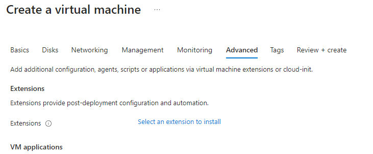
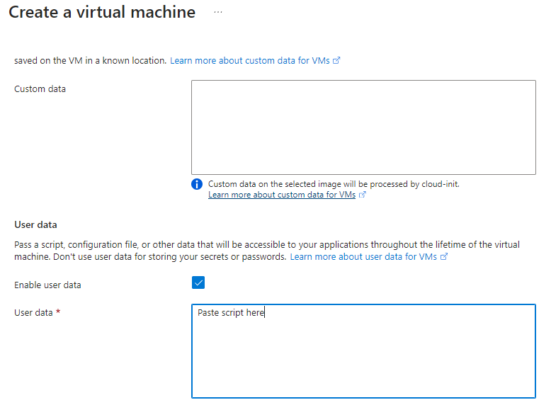

# Setting up a 2 Tier Architecture

### Monolithic Architecture

Monolithic architecture refers to a traditional software design approach where an entire application is built as a single, self-contained unit. In this architecture:

* Components: All the different functionalities of the application, such as user interface, business logic, and data access, are tightly integrated and deployed together.
  
* Communication: Components within the application typically communicate with each other through method calls or function invocations within the same memory space.
  
* Scalability: Scaling the application usually involves replicating the entire monolith, rather than scaling individual components independently.
  
* Deployment: The application is deployed as a single unit, making deployment simpler but potentially more cumbersome as the size of the application grows.

Overall, monolithic architecture offers simplicity in development and deployment but may face challenges related to scalability, maintainability, and agility as the application grows larger and more complex.


### 2 Tier Architecture

In a two-tier architecture:

1. Client Tier: Also known as the presentation tier, this layer handles the presentation logic and user interface. It interacts directly with users, receiving input and presenting output.
   
2. Server Tier: Also called the application tier or logic tier, this layer contains the application logic and data processing. It handles business logic, data manipulation, and communication with data sources or external services.

Key characteristics:

* Separation of Concerns: The architecture separates the presentation logic from the application logic, promoting modularity and maintainability.
  
* Communication: Typically, the client tier communicates with the server tier through well-defined interfaces or protocols, such as HTTP requests/responses or remote procedure calls (RPC).
  
* Scalability: Each tier can be scaled independently based on demand. For example, additional server instances can be added to handle increased load without affecting the client tier.
  
* Flexibility: Two-tier architecture can be simpler to design and implement compared to more complex architectures, making it suitable for smaller-scale applications or systems with relatively straightforward requirements.
  
Overall, two-tier architecture provides a basic yet effective separation of concerns between presentation and application logic, offering simplicity and scalability for certain types of applications. However, it may not be suitable for highly complex or large-scale systems that require more advanced scalability, fault tolerance, or modularity.


### Deploying 2 Tier Architecture Outcome

Following both my database_deploy_guide and my app_deploy_guide I have successfully launched both my database tier and my app tier.

Some important steps to not miss following this:

* It is important to load the database instance first to receieve the private IP that is generated
* It is important to remember to changed the environment variable associated IP to this private address before pasting in the script.

It's very easy to forget these steps and you won't be able to access the database.

Potential Blockers:

* If the script is exited for whatever reason the DB_HOST environment variable will need to be set again as you have excited the shell script you were in so the variable no longer exists.
* As mentioned before make sure to change the IP address in the script and that the Database instance has loaded successfully.

What I've learnt:

* I've learned just how impressive automation can be speeding up the process significantly.
* I need to make sure that I take my time to test manually as something as small as a typo has blocked my progress.
* Double check the script before accepting it's fine and running it.
* I need to update my documentation to be clearer and more descriptive for the future to make sure I can retrace these steps and avoid any potential blockers.

### User Data

User data allows you to put a script within this field and it will be ran straight away on the start up of your instance.

In my case I was able to run my database script and my app deployment script within the user data field and have the two connect to each other being able to access my database.

Some key elements to watch out for are:

* Make sure you give your database enough time to start up before starting your app
* You must after attempting to run your script for the first time in user data ssh into your instance to make sure it is running
* Don't forget to check every option before launching the instance something as small as choosing the wrong Ubuntu version has stopped me before
* Make sure to set the correct private IP so that your app can connect with the database
* You must have a shebang e.g #!/bin/bash at the top of your script to tell the user data what shell to use or it won't run
* Make sure your script is 100% working as it is much harder to troubleshoot it after having it run through user data

Something I want to mention seperately is that all commands will be ran by the root user which means the sudo command isn't needed as it is automatically being used for each command. Having the sudo command in your script won't do anyharm but this is worth noting. The directory that the user data will start from is also / which stands for root. You can take this into account within your script for example I added the line cd ~/ which moves you into the home directory where you can now CD into your app folder.

The user data option is available in the advanced tab when creating your virtual machine



If you scroll down from here and tick the user data box, then paste your script within there it will be ready to run on the boot up if your virtual machine.



### Creating an image

When you have you instance running setup in the way you want for example my database having mongodb installed and enabled.

You can then go to the overview page for you instace and select capture.

This will take what is essentially a snapshot of everything that you have installed on the instance through the use of the script. For example my database image will boot up with mongo db already running ready to go.

When creating your virtual machine you need to select your newly created image.

For certificate at the bottom you can select other as Ubuntu isn't an option.

It's very important you intialise you database vm first giving it a good 4-5mins to load up fully. After this you can intialise your app image.

For the app image because pm2 isn't a system process you can't enable it. This means you will have to add the below script into the user data section to get it running.

```
#!/bin/bash

export DB_HOST=mongodb://10.0.3.6:27017/posts 

cd ~/tech258-sparta-test-app/app

npm install

pm2 start node app.js 
```

### What is an Azure Image - what does it include, what is the equivalent called on AWS

In the context of Microsoft Azure, an "Azure Image" refers to a template that contains the operating system, applications, and other software configurations necessary to create a virtual machine (VM) within the Azure cloud environment. Essentially, it's a snapshot of a virtual machine's disk that can be used to provision multiple VMs with identical configurations.

Azure Images typically include:

1. **Operating System**: The base operating system such as Windows Server, various distributions of Linux (e.g., Ubuntu, CentOS).
2. **Pre-installed Software**: Additional software packages or applications that are included in the image.
3. **Custom Configurations**: Any custom configurations or settings applied to the operating system or installed applications.

In Amazon Web Services (AWS), the equivalent of Azure Images is called "Amazon Machine Images" (AMIs). Like Azure Images, AMIs are templates that contain the necessary information to launch EC2 instances, AWS's virtual servers. AMIs in AWS include similar components as Azure Images, such as the operating system, software applications, and configurations.

Both Azure Images and AWS AMIs serve as convenient ways to deploy standardized virtual machines quickly and consistently within their respective cloud environments.

### What is not included in the image and why

In both Azure Images and AWS AMIs, certain components or configurations are intentionally excluded. This is primarily done to maintain flexibility, minimize image size, and ensure security. Here are some examples of what is typically not included:

1. **User Data**: User data, such as files and personal configurations, are generally not included in the image. This allows users to customize instances based on their specific needs after deployment.

2. **Sensitive Information**: Confidential data, credentials, or sensitive configurations are not included to maintain security. It's crucial to avoid exposing sensitive information within shared or public images.

3. **Temporary Files**: Temporary files or caches are typically not included in the image to keep its size manageable and to prevent unnecessary bloat.

4. **Unique Identifiers**: Unique identifiers such as instance IDs or MAC addresses are not included since they are generated dynamically when instances are launched. Including them in the image would lead to conflicts and inconsistencies.

5. **Networking Configurations**: Network-specific configurations, such as IP addresses and routing tables, are not included. These settings are typically managed dynamically based on the instance's environment and deployment context.

6. **Updates and Patches**: While the base operating system and software versions are included, updates and patches released after the image creation are not. This ensures that instances launched from the image can be updated to the latest security patches and software versions during deployment.

Excluding these elements allows for greater flexibility and security when deploying instances from images. Users can customize instances, apply security updates, and adapt to changing environments without being constrained by predefined configurations included in the image.

### What is the side-effect of creating an image of a VM on Azure? (After creating the image, can you log back into the VM used to create the image?)

When you create an image of a virtual machine (VM) on Azure, it effectively captures the state of the VM at the time the image was created. One significant side effect of this process is that the original VM used to create the image is deallocated and no longer accessible in its previous state. 

Once the image creation process is complete, you can no longer log back into the original VM as it essentially ceases to exist in its previous form. Instead, you can use the created image to provision new VM instances with identical configurations as the original VM.

This behavior is common across cloud platforms like Azure and AWS when creating images or snapshots of virtual machines. It's important to understand this side effect and plan accordingly, ensuring that any necessary data or configurations are backed up or transferred before creating the image if you need to retain access to the original VM.

### The little bit of user data needed to get the app running with the posts page (and what can be commented out if you don't need the posts page to work)

The script below is what is needed to add into the user data section.

```
#!/bin/bash

export DB_HOST=mongodb://10.0.3.6:27017/posts 

cd ~/tech258-sparta-test-app/app

npm install

pm2 start node app.js 
```

If you are looking to just get the app working but not the posts page you can comment out the part that sets the environment variable to remove the connection between the two instances.

```
#!/bin/bash

# export DB_HOST=mongodb://10.0.3.6:27017/posts 

cd ~/tech258-sparta-test-app/app

npm install

pm2 start node app.js 
```