# Azure 2 Tier App Deployment

### Pairing a SSH key

:boom: Please follow https://github.com/LewisTowart/tech258_git/blob/main/ssh_keys_setup.md to generate the new key pair

### Step 1.

Go to https://portal.azure.com/ to access azure cloud services.

### Step 2.

Search within the search bar for SSH keys and click on the option that shows up.

### Step 3.

Go to create a new key and select resource group as Tech258, make sure the region selected is UK South.

### Step 4.

Paste in the public key you will have by follow the guide mentioned at the beggined of this document. Also make sure to add a owner tag with your name for clarity.

### Setting up a Virtual Network

In this step we are going to setup a virutal network and assign different IP ranges.

### Step 1.

As before you need to search for Virtual Network in the Azure portal page and click on the Virtual Networks option.

### Step 2.

Keep the subscription as Azure Training and select the tech258 resource group.

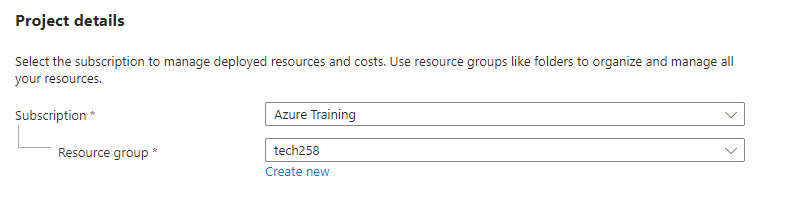

For the instance details name the network tech258-Lewis-2-subnet-vnet :boom: Make sure you are on (Europe) UK South.

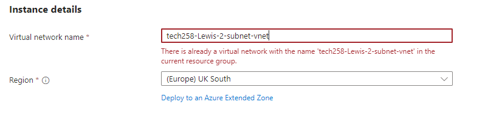

### Step 3.

Navigate past the security section leave that as is for now and go over to the IP addresses.

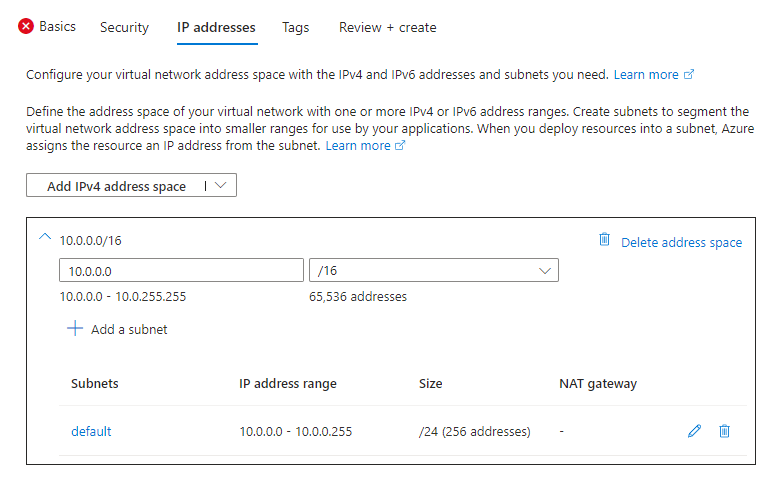

We are now going to click on add subnet and make two new subnets one for the database and one for the app which can be seen in the next steps.

### Step 4.

You now want to change the name of the first new subnet to public-subnet this will later be associated with the app. You will also need to change the starting address to 10.0.2.0 make sure the address range is still 10.0.0.0/16. Finally make sure the size is correct in our case we want /24 (256 addresses).

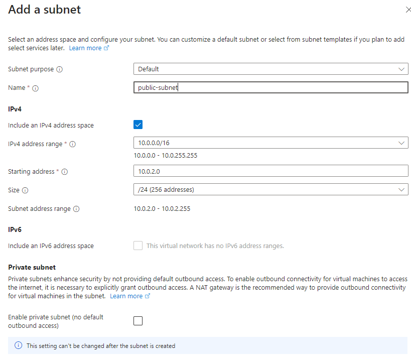

Make sure to leave everything else as it is and click save

You now need to repeat this process with some slight changes. click on add subnet again. This time change the name of the second new subnet to private-subnet this will later be associated with the database. You will also need to change the starting address to 10.0.3.0 make sure the address range is still 10.0.0.0/16. Finally make sure the size is correct in our case we want /24 (256 addresses).

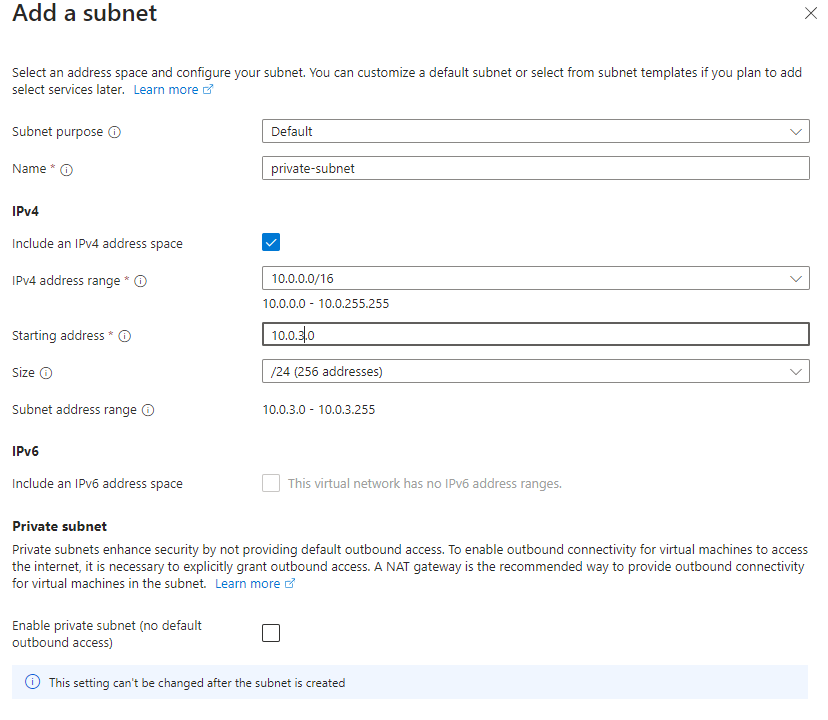

### Step 5.

Move across to the tags sections.

We need to make sure to create a owner tag in the name section and put our name in the value section.

### Step 6

Now navigate over to review and create.

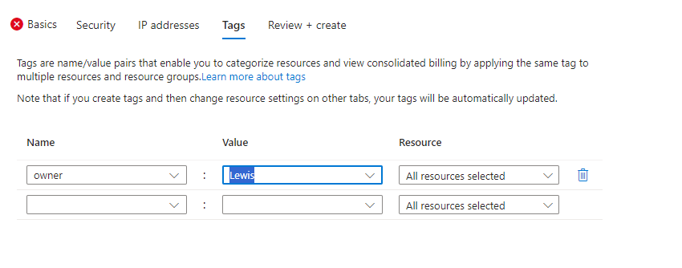

Make sure to double check all settings are correct before clicking create at the bottom.

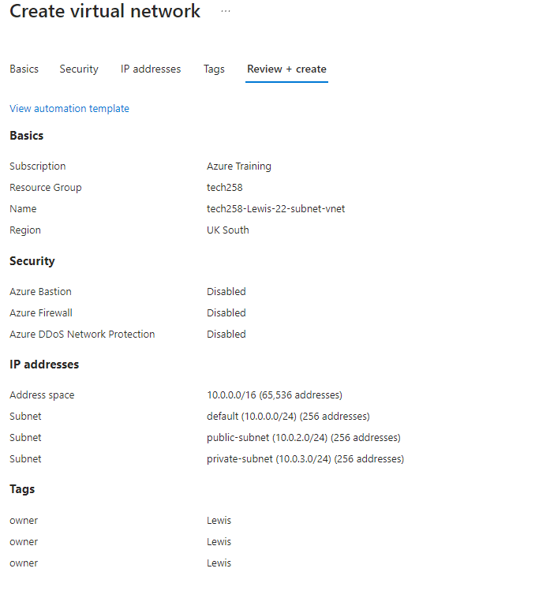

### Setup Virtual Machine

Follow these steps to setup a virtual machine for both the database and the app deployments.

### Database Setup

### Step 1.

Using the search bar look up and select Virtual Machines.

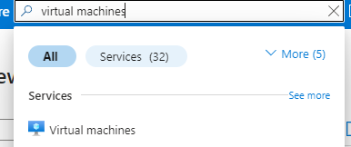

On this page select the create drop fown menu then select Azure virtual machine to starting making a new VM.

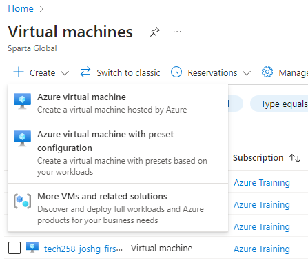

### Step 2.

Now you are going to need to update a few important details on this page.

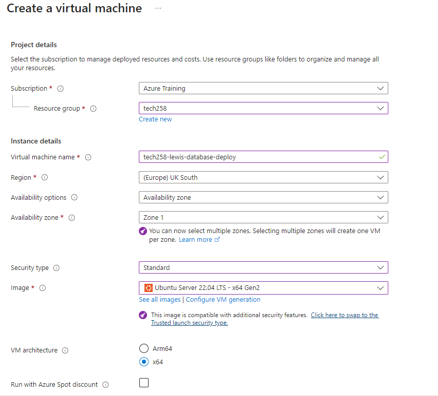

First let's make sure that our subscription is Azure Training and resource group is tech258

Next name the machine in this case we will start with the database naming it tech258-lewis-database-deploy. The region here should also be (Europe) UK South and leave the availability zones as they are.

Final important steps is to change the security type to standard and make sure you are using Ubuntu Server 22.04 LTS - x64 Gen2 as your image.

### Step 3.

Scrolling down still on the same page we need to make some more changes.

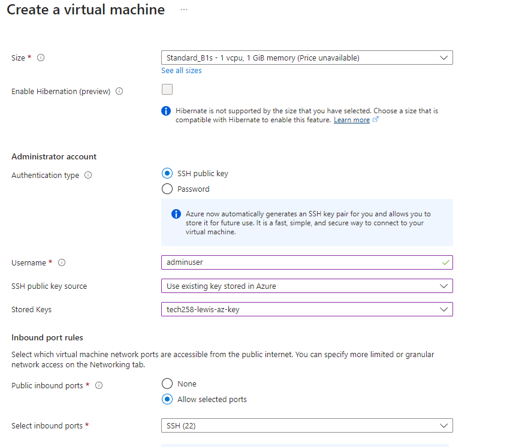

First we need to make sure we are using Standard_B1s for the Size. If it is not selected use see all sizes to find it.

Next we need to select SSH public key as our authentication type. Change the username to adminuser and select use existing key from the drop down menus for SSH public key source.

Finally select the key you have setup earlier in this case mine was tech258-lewis-az-key. (public key)

### Step 4.

Navigate over to the next page titled disks.

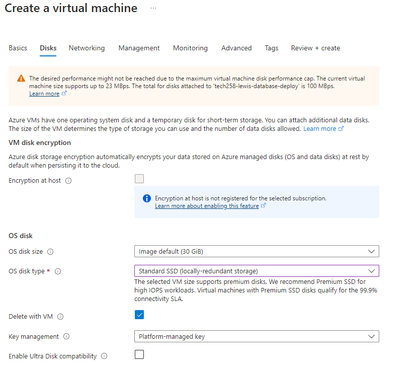

We now need to only change the section that says OS disk type. This needs to be standard SSD.

### Step 5.

Navigate over to the next page titled networking.

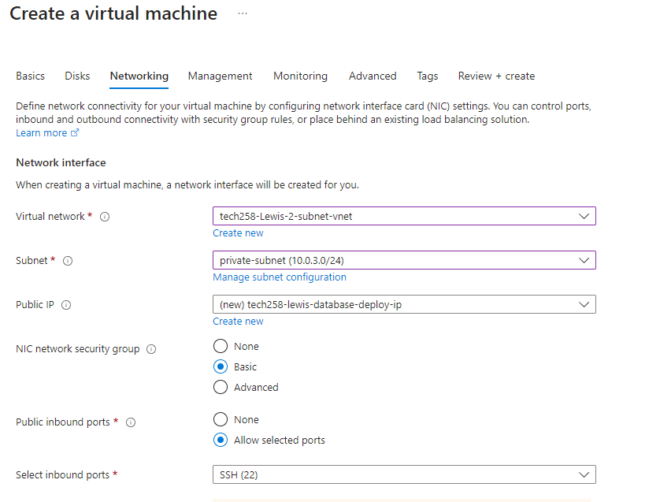

First we are going to want to select our virtual network we made earlier mine being titled tech258-Lewis-Subnet-vnet.

As this is the database we are setting up first we need to make sure top select the private subnet 10.0.3.0/24 that we created.

### Step 6.

As for this next step I want to highlight it will be different for the App VM. In this case we can leave the security group as basic and just make sure to allow inbound ports from SSH then move on to the next step.

### Step 7.

Navigate over to the tags area now leave everything else as it is in the other tabs.

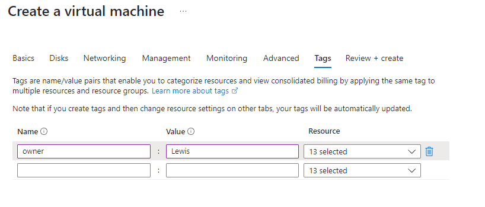

Create and owner tag as previously done assign with the value of your name in my case Lewis.

### Step 8.

Now navigate over to review and create.

Make sure to double check all settings are correct before clicking create at the bottom.

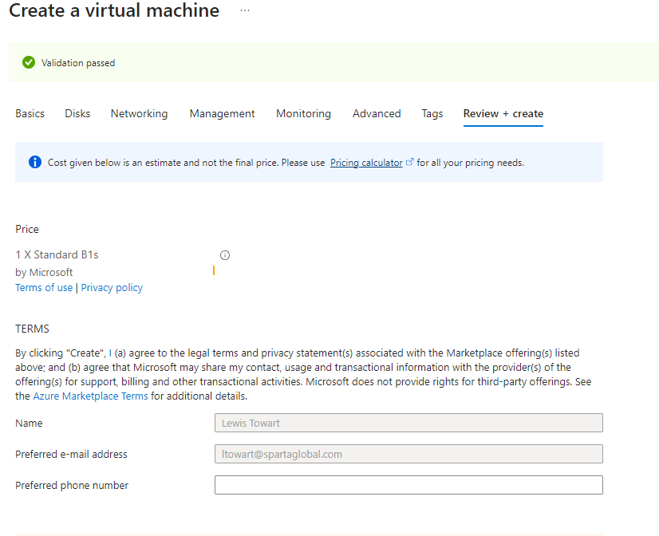

### App Setup

### Step 1.

:boom: Please follow the same step as listed above for the Database setup.

### Step 2.

:boom: Please follow the same step as listed above for the Database setup making sure to name it something like tech258-lewis-app-deploy this time.

### Step 3.

:boom: Please follow the same step as listed above for the Database setup.

### Step 4.

:boom: Please follow the same step as listed above for the Database setup.

### Step 5.

Navigate over to the next page titled networking.

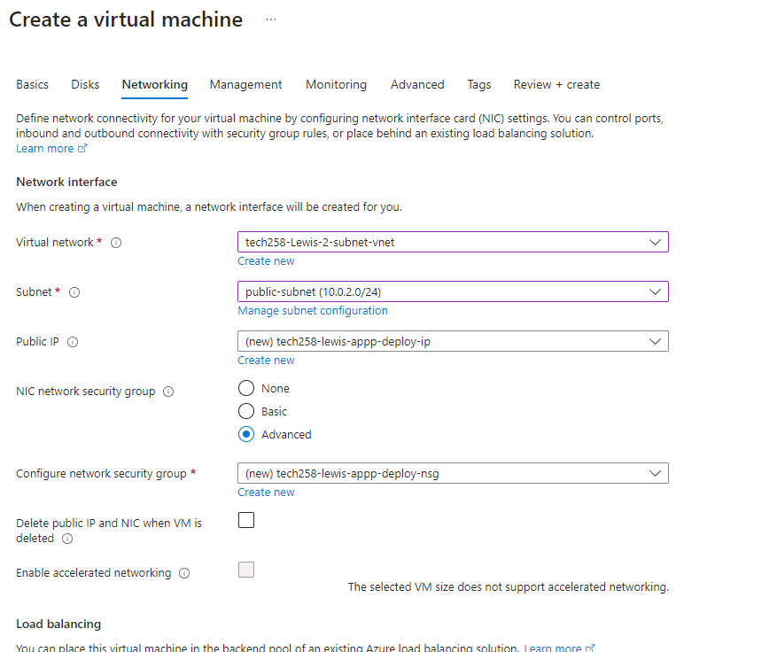

First we are going to want to select our virtual network we made earlier mine being titled tech258-Lewis-Subnet-vnet.

As this is the app we are setting up first we need to make sure top select the private subnet 10.0.2.0/24 that we created.

### Step 6.

You are now going to click on advanced for the NIC network security group section.

Below configure network security group click create new.

Here you can see SSH is already setup for us. We are going to want to click on add an inbound rule.

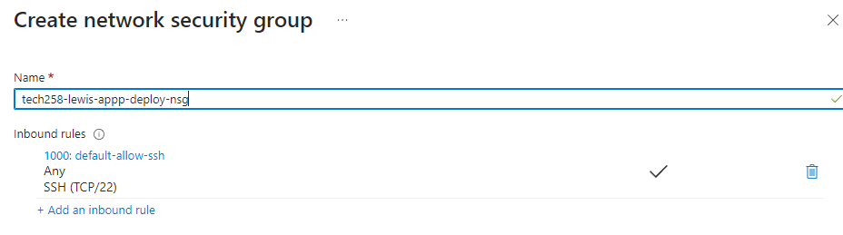

Here we are going to change the destination port ranges to 3000 referencing node.js. We are also going to select the TCP protocol. Once done click add at the bottom.

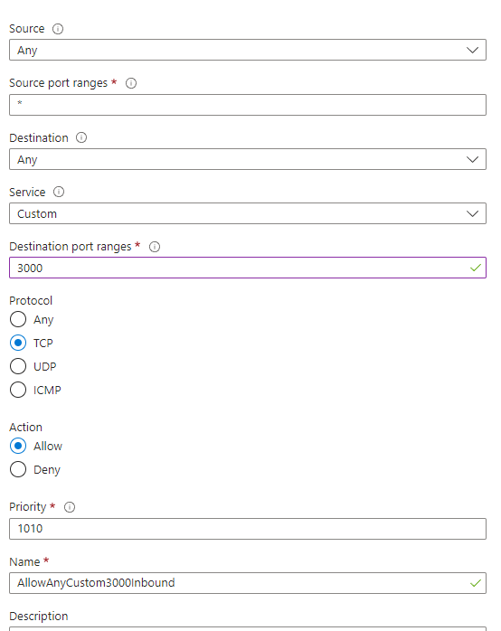

We need to do this one more time for HTTP. Click add an inbound rule and this time from the service drop down click HTTP and then select add.

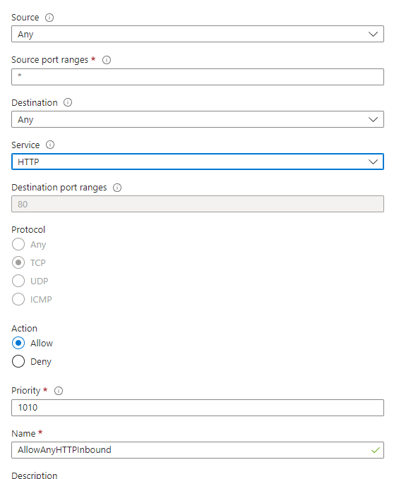

### Step 7.

:boom: Please follow the same step as listed above for the Database setup.

### Step 8.

:boom: Please follow the same step as listed above for the Database setup.

### Differences to AWS

On Azure our Network virtual machine needed to be created by us indivdually for our VM instances whereas on AWS it was already done for us.

Mongodb doesn't need to have it's port 27017 referenced on Azure where as on AWS we needed to add it to the security group.

The public ips we set within the Network VM stay the same in AWS they always changed.

