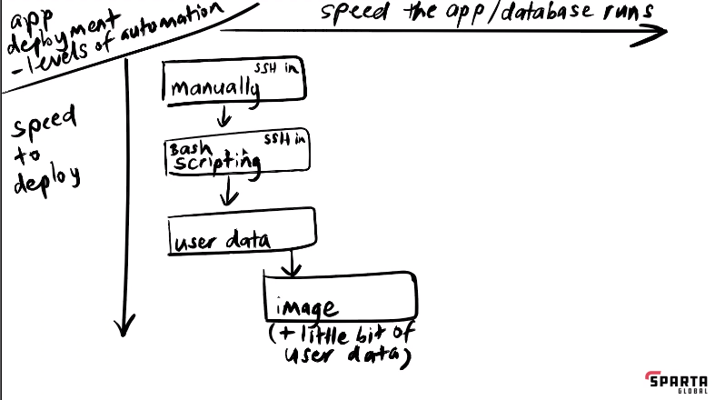

# Advanced Azure

### MongoDB open port azure

on default sg rule on azure is to allow any internal traffic on your internal network. All devices internal on the inside of your virtual network can talk to each other ragrless of their subnet.

Like the Virtual network is an apartment the subnets are the rooms. Azure can walk between the rooms and talk to each other. On AWS you can't only in the same room.

AWS you need to open the port for internal traffic.

### Public instead of private

we have only set rules for incoming traffic so far

you would have to open the 27017 port on the inbound of the database to use the public IP

# Levels of automation

*Replace with my own*

In the above diagram you can see the affect these various levels of automation can have on the speed of deployment and the speed that the app/database runs.

To clearly explain these I will first start by describing the speed to deploy. Originally we tested everything manually before writing a script. The speed to actually deploy the instance and have it ready to go to start the app/database was significantly increased. This is further seen when user data was added avoiding the need to ssh in create and run the script. Then even further imrpoved when the image was created and for the database having to just load the instance with the image to be ready to run.

Now looking at the speed the app/database runs. This is an intersting one as it is important to note a command will only run as fast as they can so unless you are skipping commands that need to be ran this won't speed up. In the case of the image this is exactly what is happening. On the database side Mongodb is already installed and good to go. On the app side we still need some user data but no where near as much.

commands will only run as fast they can so speed to deploy is faster as you are skipping steps you need to take but they still need to run

speed of the app increase at image because those commands don't need to be ran

user data runs as root so will use sudo whether you put it or not
starting directory will be the root folder /
only runs on the start up of the vm

try to get one script that works in user data and ssh in

how to delete your vm properly section
