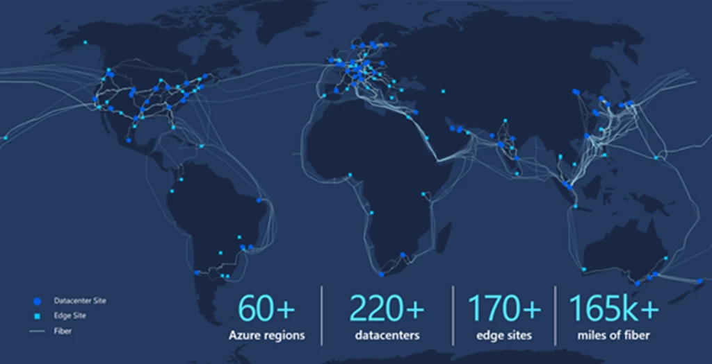

# Azure

- [Azure](#azure)
    - [What are the basics of Azure?](#what-are-the-basics-of-azure)
    - [Azure regions and how they work](#azure-regions-and-how-they-work)
    - [How is Azure structured and organised](#how-is-azure-structured-and-organised)
    - [What types of services does Azure provide?](#what-types-of-services-does-azure-provide)
    - [Ways to access Azure?](#ways-to-access-azure)
    - [The difference between Azure and Azure DevOps](#the-difference-between-azure-and-azure-devops)
      - [Azure](#azure-1)
      - [Azure DevOps](#azure-devops)
    - [Why use the Azure Pricing Calculator?](#why-use-the-azure-pricing-calculator)

### What are the basics of Azure?

Azure is a cloud computing platform provided by Microsoft. It offers a wide range of services, including computing power, storage, networking, databases, machine learning, and more, all delivered over the internet. Here are some basic concepts to understand:

* Infrastructure as a Service (IaaS): Azure provides virtual machines, storage, and networking resources, allowing users to run their applications and manage their infrastructure in the cloud without worrying about physical hardware.

* Platform as a Service (PaaS): Azure offers platform services such as Azure App Service, Azure SQL Database, and Azure Functions, which abstract away the underlying infrastructure and allow developers to focus on building and deploying their applications.

* Software as a Service (SaaS): Azure hosts a variety of software applications accessible over the internet, such as Office 365, Dynamics 365, and more.

* Azure Portal: This is the web-based interface where users can manage their Azure resources, configure services, and monitor their applications.

* Azure Resource Manager (ARM): ARM is the deployment and management service for Azure. It provides a consistent management layer for resources in Azure, allowing users to deploy, update, and manage resources as a group.

* Azure Virtual Network: This allows you to create private networks in the Azure cloud, providing isolation, segmentation, and connectivity to your Azure resources.

* Azure Storage: Azure offers scalable and secure storage services, including Blob storage for unstructured data, File storage for file shares in the cloud, and Table storage for structured NoSQL data.

* Azure Compute: Azure provides various compute options, including Virtual Machines, Azure Kubernetes Service (AKS) for container orchestration, Azure Functions for serverless computing, and more.

* Azure SQL Database: This is a fully managed relational database service provided by Azure. It offers high availability, security, and scalability for your SQL database workloads.

* Azure AI and Machine Learning: Azure offers services like Azure Machine Learning, Cognitive Services, and Azure Databricks for building, training, and deploying machine learning models and AI-powered applications.
These are just some of the basic concepts of Azure. It's a vast platform with many services catering to different use cases and industries.

These are just some of the basic concepts of Azure. It's a vast platform with many services catering to different use cases and industries.

### Azure regions and how they work

Azure regions are geographic locations where Azure data centers are located. Each region is made up of one or more data centers that are connected by a low-latency network. These regions are distributed around the world to provide customers with options for deploying their applications and data closer to their users.

Within each region, Azure offers availability zones. Availability zones are unique physical locations within an Azure region, with independent power, cooling, and networking. They are designed to provide fault tolerance and high availability for applications and data by distributing them across multiple zones within a region. This helps to ensure resilience against failures, such as hardware failures or natural disasters, as applications can be deployed across different zones to minimize the impact of such events.

In simple terms, Azure regions are like big areas on the map where Azure has its data centers, and availability zones are like different buildings within each region. By spreading your applications and data across different availability zones within a region, you can increase the resilience and availability of your services, ensuring they remain operational even if one zone experiences issues.

### How is Azure structured and organised

Azure is structured and organized in several layers, each serving different purposes and catering to various user needs:

* Physical Infrastructure: At the base layer, Azure consists of physical data centers located in different regions around the world. These data centers house servers, storage devices, networking equipment, and other hardware infrastructure necessary to provide cloud services.

* Regions: Azure is divided into regions, which are geographical areas containing one or more data centers. Each region is independent and is designed to provide low-latency access to Azure services for users and applications in that geographic area. Regions are further grouped into geographies for organizational purposes, such as Azure's regions in North America, Europe, Asia Pacific, and so on.

* Availability Zones: Within each region, Azure offers availability zones. Availability zones are physically separate data centers within a region, each with its own power, cooling, and networking infrastructure. They are designed to provide high availability and fault tolerance by distributing applications and data across multiple zones within the same region.

* Data Centers: Within each availability zone, there are multiple data centers containing racks of servers and networking equipment. These data centers are designed to ensure redundancy and resilience, with backup power supplies, cooling systems, and physical security measures

* Networking Infrastructure: Azure provides a robust networking infrastructure that connects all its data centers and regions together. This includes high-speed networks, content delivery networks (CDNs), virtual networks (VNets), and other networking services to facilitate communication between Azure resources and with the outside world.

* Services and Resources: At the top layer, Azure offers a wide range of cloud services and resources, including computing (virtual machines, containers), storage (blobs, files, databases), networking (load balancers, VPN gateways), analytics (data lakes, machine learning), and more.

* These services are accessible through the Azure Portal, APIs, command-line tools, and SDKs, allowing users to deploy, manage, and scale their applications and infrastructure in the cloud.

Overall, Azure's structure is designed to provide a scalable, reliable, and globally distributed cloud platform that meets the diverse needs of businesses and developers around the world.

* Whatever you create in terms of resources possibly an instance or virtual network, these need to be grouped into a resource groups.

These groups are like containers, every resource group has to be associated with a particular subscription.

* A subscription is like a payment account every subscription you have to pay in a certain way linked to a certain card. 
 
You can have different types of subscription such as student subscription, trial subscription, pay as you go subscription.

Every subscription has limits and quotas such as you can have 50 of the same size VM in a single region for one subscription. You wouldn't be able to make more than 50 as you will receieve an error. You could then  use a different size VM, change region or get another subscription. 

* Management groups e.g the root management group (azure AD/entra tenent)- stores users, groups and policies, you can organise your subscriptions into different management groups.
 
These management groups are like folders, you can have them inside each other up to 6 levels not including the root. They are all considered different scopes for each level you can set different access permissions and policies. For example have been set to a resource group that lets us create, see and manage those specific resources.

### What types of services does Azure provide?

Azure provides a vast array of services across various categories to cater to different needs and use cases. Here's an overview of the types of services Azure offers:

* Compute: Provides resources for running applications and workloads, including Virtual Machines (VMs), Azure Kubernetes Service (AKS) for container orchestration, and Azure Functions for serverless computing.

* Storage: Offers scalable and durable storage solutions like Blob Storage for unstructured data, Azure Files for managed file shares, and Azure Disk Storage for block storage.

* Databases: Offers various database services such as Azure SQL Database for relational databases, Azure Cosmos DB for globally distributed NoSQL databases, and Azure Database for MySQL for managed MySQL databases.

* Networking: Provides services for connecting and securing applications and resources, including Virtual Network (VNet), Azure Load Balancer, and Azure VPN Gateway.

* Identity and Access Management: Manages user identities and access to resources with services like Azure Active Directory (AAD) and Azure Role-Based Access Control (RBAC).

* AI and Machine Learning: Enables building and deploying AI and ML models with Azure Machine Learning, Azure Cognitive Services for adding AI capabilities, and Azure Databricks for collaborative analytics.

* Development Tools: Offers tools and services for application development and DevOps, such as Azure DevOps for collaboration, Azure App Service for hosting applications, and Azure Functions for serverless computing.

* Internet of Things (IoT): Provides services for building and managing IoT solutions, including Azure IoT Hub for device connectivity, Azure IoT Central for simplifying IoT solution development, and Azure IoT Edge for edge computing.

* Analytics: Enables storing, processing, and analyzing data with services like Azure HDInsight for Apache Hadoop and Spark clusters, Azure Stream Analytics for real-time data processing, and Azure Data Lake Analytics for distributed analytics.

* Security and Compliance: Offers services for securing and protecting data and resources, such as Azure Security Center for threat protection, Azure Key Vault for managing cryptographic keys, and Azure Policy for enforcing compliance policies.

### Ways to access Azure?

There are several ways to access Azure services and resources:

* Azure Portal: The Azure Portal is a web-based interface provided by Microsoft for managing Azure services. It offers a graphical user interface (GUI) that allows users to create, configure, and monitor Azure resources using a web browser. The Azure Portal is accessible at portal.azure.com.

* Azure CLI (Command-Line Interface): Azure CLI is a command-line tool that allows users to manage Azure resources from a terminal or command prompt. It provides a set of commands for interacting with Azure services, such as creating virtual machines, managing storage accounts, and deploying applications. Azure CLI is available for Windows, macOS, and Linux.

* Azure PowerShell: Azure PowerShell is a scripting environment built on top of Microsoft PowerShell that enables users to automate and manage Azure resources using PowerShell cmdlets. It provides a scripting language and a set of cmdlets specifically designed for interacting with Azure services.

* Azure SDKs (Software Development Kits): Azure SDKs are libraries and APIs provided by Microsoft for various programming languages, including .NET, Java, Python, Node.js, and more. They allow developers to integrate Azure services into their applications and automate management tasks programmatically.

* REST APIs (Representational State Transfer Application Programming Interfaces): Azure services expose RESTful APIs that allow users to interact with them programmatically over HTTP. Users can send HTTP requests to Azure APIs to perform operations like creating resources, managing configurations, and retrieving data.

* Azure Mobile App: The Azure mobile app provides a mobile-friendly interface for managing Azure resources on the go. It allows users to monitor the health and performance of their Azure services, receive notifications, and perform basic management tasks from their mobile devices.

* Azure Management Libraries: Azure Management Libraries are client libraries provided by Microsoft for various programming languages. They offer a higher-level abstraction over the Azure REST APIs, making it easier for developers to interact with Azure services from their code.

### The difference between Azure and Azure DevOps

Azure and Azure DevOps are both offerings from Microsoft, but they serve different purposes:

#### Azure

Azure is a cloud computing platform provided by Microsoft. It offers a wide range of cloud services, including computing, storage, databases, networking, AI, IoT, analytics, and more. Azure enables businesses to build, deploy, and manage applications and services in the cloud, providing scalability, reliability, and flexibility.

#### Azure DevOps

Azure DevOps is a set of cloud-based collaboration tools for software development, delivery, and operations. It provides a suite of services for the entire software development lifecycle, including:

* Azure Repos: A Git repository hosting service for version control of code.

* Azure Pipelines: A continuous integration and continuous delivery (CI/CD) service for automating build, test, and deployment pipelines.

* Azure Boards: A project management and issue tracking service for planning, tracking, and collaborating on work items and tasks.

* Azure Test Plans: A testing service for manual and exploratory testing, as well as test case management.

* Azure Artifacts: A package management service for storing and sharing software artifacts like packages, binaries, and container images.

While Azure provides the infrastructure and platform services for building and deploying applications, Azure DevOps complements it by providing tools and services for managing the software development process, facilitating collaboration among development teams, and automating software delivery pipelines.

In summary, Azure is a cloud computing platform for building and deploying applications, while Azure DevOps is a suite of tools and services for managing the software development lifecycle. They can be used together to streamline the development, delivery, and operation of applications in the cloud.

### Why use the Azure Pricing Calculator?

The Azure Pricing Calculator is a tool that helps users estimate and compare the cost of Azure services to plan and optimise their cloud spending.

The Azure Pricing Calculator is a valuable tool for several reasons:

* Cost Estimation: It helps users estimate the cost of Azure services based on their specific requirements before they start using them. This allows for better budgeting and planning, ensuring that users have a clear understanding of the potential costs associated with their deployments.

* Resource Comparison: Users can compare the pricing of different Azure services and configurations to find the most cost-effective options for their needs. The calculator provides detailed breakdowns of pricing components, allowing users to make informed decisions about resource allocation.

* Scenario Modeling: Users can create and save multiple scenarios to compare different deployment options, such as varying resource sizes or service configurations. This enables users to explore different scenarios and choose the one that best fits their budget and performance requirements.

* Cost Optimization: The calculator helps identify potential cost savings by suggesting ways to optimize resource usage and configuration. Users can adjust parameters such as service tiers, regions, and usage patterns to find cost-effective solutions without sacrificing performance or functionality.

* Transparency: By providing transparent pricing information, the calculator helps build trust and confidence in Azure services. Users can see exactly what they're paying for and understand how different factors impact pricing, leading to more informed decision-making.
Overall, the Azure Pricing Calculator is a valuable tool for estimating, comparing, and optimizing the cost of Azure services, helping users make informed decisions and maximize the value of their cloud investments.

