# Autoscaling

To create this our base image was one from the marketplace Ubuntu 22.04 which we used to create our VM. We then prepared the VM to be ready to run the app.

We could've created our own base image from Ubuntu.com by downloading it and getting a virtual hard disk file. This would be a pretty standard starting image. You would then have to put this into blob storage on Azure. This can then be used to create the custom image. You don't have to choose one from the marketplace.

I want to note it is imperative that you have tested you custom image and that the added user data for the app works. Before creating an autoscaling group you need to be 100% confident in yur image and the user data you are adding in.

Now we have our custom images ready to start both the the database and app quickly we can use this to create our autoscaling group.

### Using a Azure VM Scale set

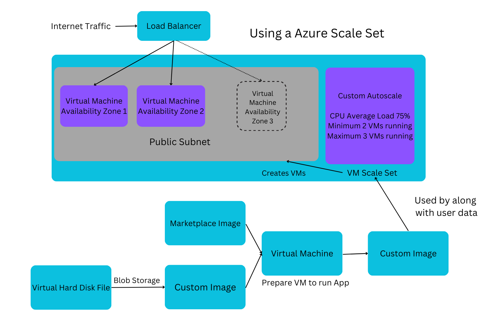

The virtual machine scale set is going to use our custom image along with our bit of user data needed to get the app running. This scale set is going to create our virtual machines. It will also create 2 by default on start up.

We need to set up the policy for it to do this, it's called a custom autoscale. So we'll start with if average CPU load reaches 75% (looking at all the vms set under the scale set). We're going to have a minimum setting of 2 virtual machine (so that we always have a backup) and a maximum of 3. They are going to get added to our virtual network in the public subnet we created. This is because it needs to be available to the public they need to be able to access it. We need to put them in different availability zones so that we again increase availability.

Now we also need a external facing load balancer to take in incoming traffic and decide which virtual machine is best to sent that traffic to. It's balancing out the load to each virtual machine usually based on their CPU usage.

We have high availability due to having two VMs running the app. If something happens to one the other will still be up. We also launch them across multiple availability zones in case one goes down, you can still use the availability zone.

### Creating a Scale set for my App

#### Step 1.

Search for and select Virtual Machine Scale Sets on the Azure portal page.

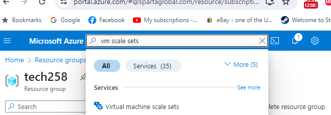

Now select the create new option

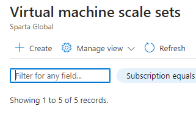

#### Step 2.

We need to add a sensible name and select Zone 1, Zone 2, Zone 3 in the availability zones drop down.

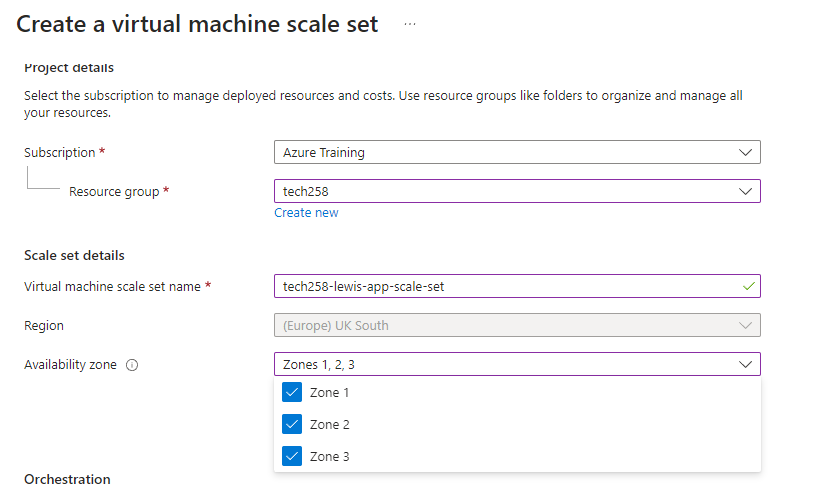

You are also going to want pick uniform so that each VM is the same size and autoscaling so that we don't manually have to create new VMs.

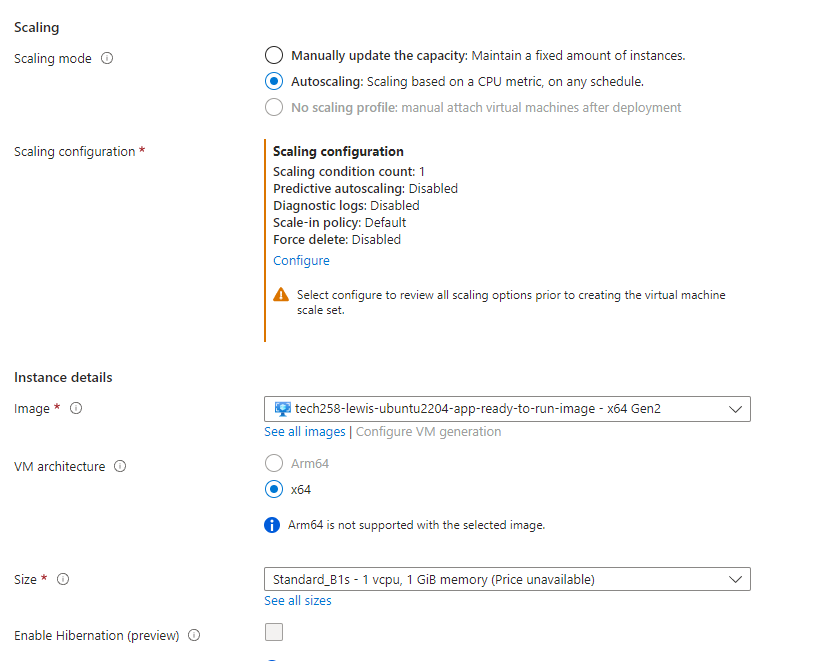

Now we need to select the option that appears to configure our autoscaling condition. This can also be seen in the image above. I also want to note that the image you select should be double checked to be the right one.

#### Step 3.

Once we select that option we need to click the edit button as seen in the image below.

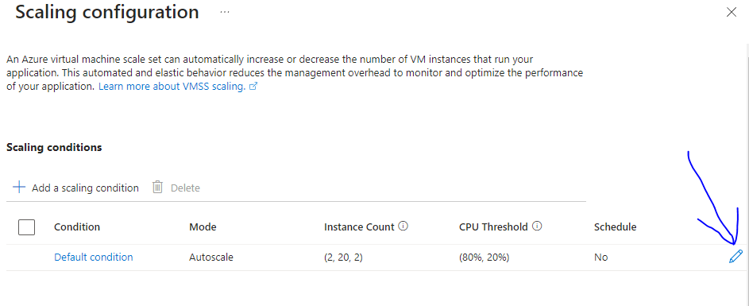

Next we need to add the same settings as seen in the images below.

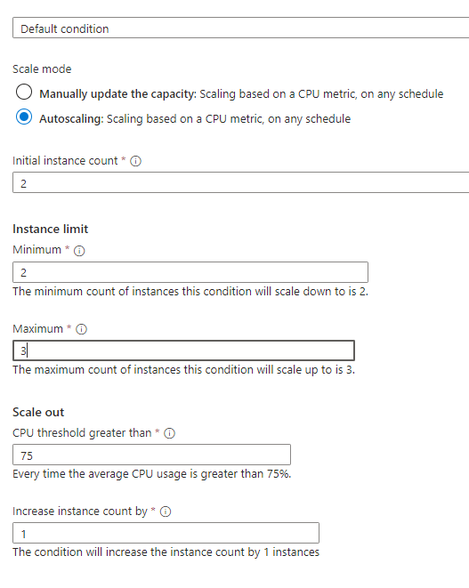

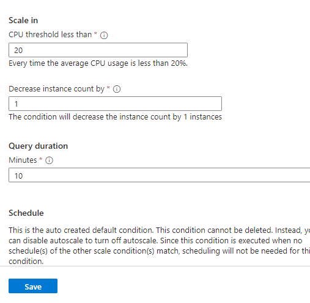

Next we need to set our ssh keys to the ones we paired on Azure and select other for license type.

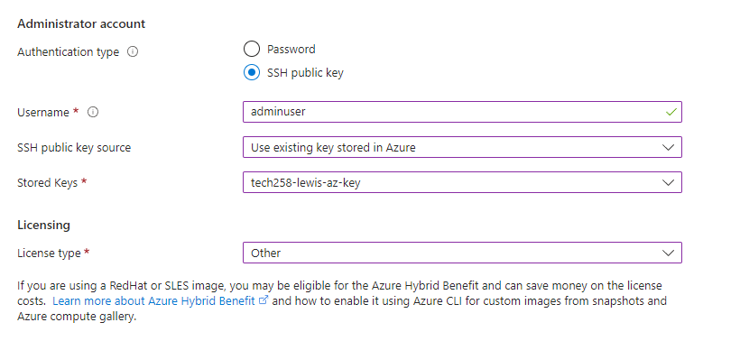

#### Step 4.

Now moving over to the disk we want to select standard SSD

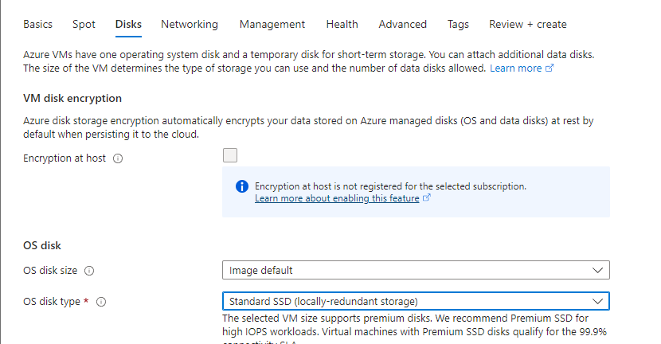

Now we can move across to networking where we need to select our virtual network we made and edit the current subnet that is there as seen in the picture below.

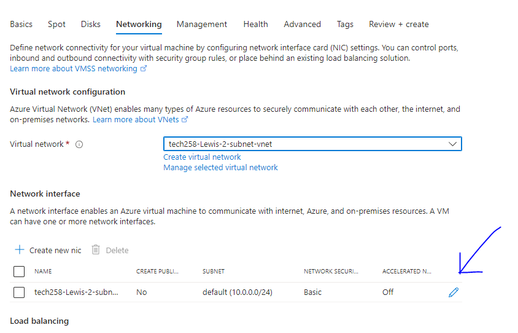

In these settings we are selecting the virtual network we have created, our public subnet we created within that network and our previously made security group allowing ssh and http traffic.


#### Step 5.

Still on the network tab scroll down and select create a load balancer.

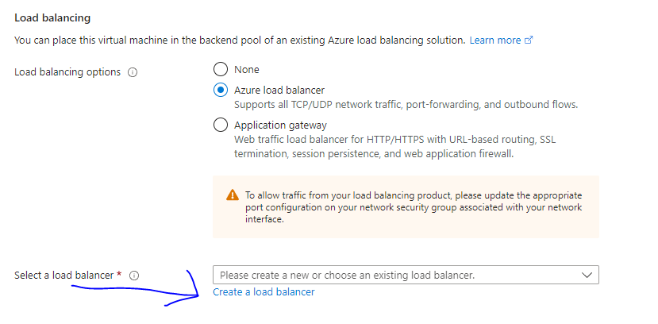

Now we can make sure to name our load balancer something sensible and input the following settings as seen in the image below.

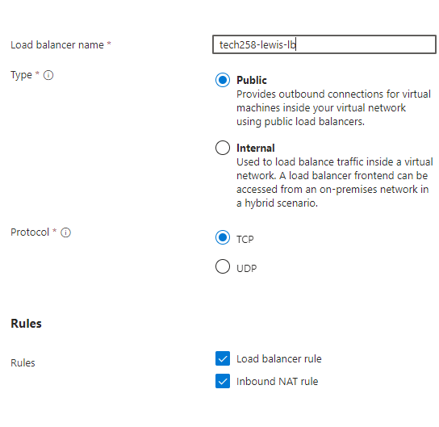

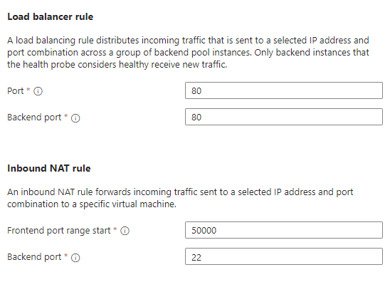


#### Step 6.

Now move over to the health tab. Here we are going to select enable application health monitoring and enable automatic repairs. These settings allow automatic monitoring of our instance health and if an instance remains unhealthy for the 10 minute window we have set it will be replaced with a new fresh instance.

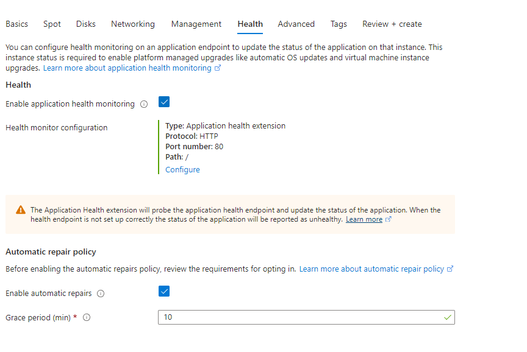

### Step 7.

We now want to navigate over to the advanced tab to add our user data.

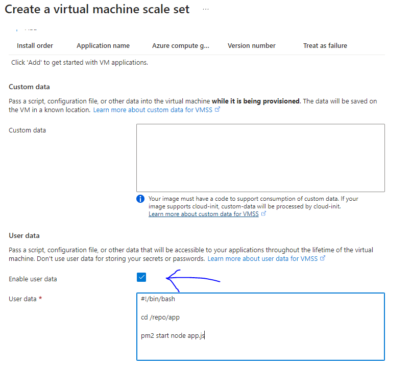

Finally before we review we need to add our owner tag as seen below

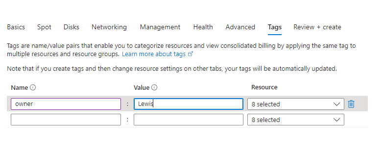

Before we create make sure all settings are as they should be then you are good to go.

#### How to ssh into your VM

Now to ssh into our VM we are going to have to use a slightly different command than usual.

Here is the command that is we have been running before

```
ssh -i <private key path> adminuser@10.0.2.4
```

This time we have multiple virtual machines running at once that are being sent traffic which is controlled by the load balancer.

The load balancer can take ssh requests but needs to output them to the correct port. We previously set this port range to start at 50000.

Using the command below we can send out ssh request to the load balancer and have it direct us to the virtual machine we are targeting.

It will also not take a request from an internal private key as it has been setup to be externally facing only taking requests from public traffic. We need to change the IP address on the end to the public one associated with our load balancer. You can change the 50000 number to whichever VM you are trying to target, for example our second VM created would be 500001.

```
ssh -i <private key path> -p 50000 adminuser@4.159.36.237
```

#### Load Balancer

A load balancer is responsible for a task similar to it's name. It will balance the traffic accessing our virtual machines app between all of the active virtual machines. If the average CPU load between the virtual machines reaches 75% this is when our autoscaling group will create another virtual machine.

The load balancer will consistently send the outside public internet traffic to each virtual machine if one is not longer available it will send it to the other virtual machine. Likewise if the availability zone is down it will also know and automatically start sending the traffic to the virtual machine on the other availability zone.

All traffic needs to go through the load balancer so that it can redirect it evenly to each virtual machine.

#### How to Clean Up you Autoscaling Group

The easiest way that I have found assuming you have been using the correct name convention is to go to the resource group you are a part of, mine being Tech258.

You can then search for your name which should be associated with everything you have created. From here you can see which elements you want to delete.

Make sure not to delete your Virtual network, ssh key, security groups and images. These will be reused throughout our course.

#### Virtual Machine Health

Through the settings we selected earlier we can test out instance health.

If you stop and restart one of our virtual machines the app will no longer be running as the user data only runs once. Here we can now see the health of our instance will say unhealthy. This is because now that the app is no longer running the load balancer can no longer send traffic towards that virtual machine.

Our automatic repair option after 10 minutes grace period of our instance being unhealthy will delete it and replace it with a fresh new virtual machine.

#### Re-Image and Upgrade

If you re-image one of your virtual machines it will use a fresh image in it's original state without the user data.

If you upgrade your image it will use the newest version of your image including any user data you may have changed.