- [Monitoring and Alert Management](#monitoring-and-alert-management)
    - [Worst case to Best case](#worst-case-to-best-case)
    - [What is an availability set? How do they work?](#what-is-an-availability-set-how-do-they-work)
    - [What is an availability zone? Why superior to an availability set?](#what-is-an-availability-zone-why-superior-to-an-availability-set)
    - [What is a Virtual Machine Scale Set? What type of scaling does it do? How does it work? Limitations?](#what-is-a-virtual-machine-scale-set-what-type-of-scaling-does-it-do-how-does-it-work-limitations)
    - [Setting up a Dashboard](#setting-up-a-dashboard)
    - [Setting up Alerts](#setting-up-alerts)
      - [Step 1.](#step-1)
      - [Step 2.](#step-2)
      - [Step 3.](#step-3)
    - [Testing Your Alert](#testing-your-alert)
      - [Testing for Autoscaling](#testing-for-autoscaling)

# Monitoring and Alert Management

### Worst case to Best case

*add own diagram

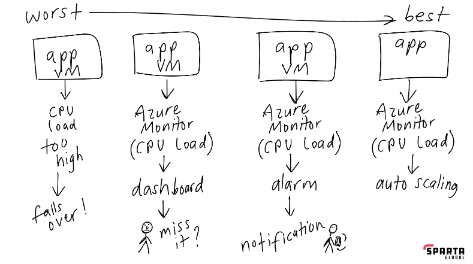

Worst Case:

* Starts with app vm no one is doing any monitoring
* Gets flooded with traffic affecting the cpu load it's getting way too high
* Then the app falls over isn't working

(monitoring is happening in the background by default)

Better case:

* Default monitoring is being done. For Azure it's called azure monitor and for AWS it's called cloud watch
* This can be shown on a dashboard but someone would need to be checking it at all times
* If someone isn't watching they may miss the issue and again the app falls over


Even better case:

* Azure monitor can see if the cpu load is too high (value needs to be set manually)
* Alert will be set off
* Notifications are sent as a result of the alert


Best case:

* Azure monitor cpu load is too high (value needs to be set)
* Alarm is triggered, to automate we need auto scaling - On
Azure it's called virtual machine scale sets and on AWS it's called autoscaling group
* New virtual machines can be created to deal with the traffic and removed when it goes back down, scaling out and in scales the number of vms running. (it's not replacing your vm with a larger one which would be scaling up)

### What is an availability set? How do they work? 

An Availability Set in Microsoft Azure is a feature designed to enhance the reliability and availability of virtual machines (VMs). It works by grouping VMs together and distributing them across multiple physical servers (fault domains) and racks (update domains) within an Azure data centre.

Advantages:

* High Availability: VMs are spread across fault and update domains, ensuring accessibility during hardware failures or maintenance.
  
* Uptime Guarantee: Azure SLA promises 99.95% uptime for VMs in Availability Sets, meeting business continuity needs.
  
* Resilience to Failures: Fault domain distribution prevents single hardware failures from impacting all VMs.
  
* Reduced Downtime: Update domain separation minimizes downtime during maintenance by staggered updates.
  
* Simplified Management: Availability Sets streamline VM management, handling high availability considerations automatically.
  
* Load Balancing: Built-in load balancing optimizes resource use and enhances application scalability.
  

Disadvantages

### What is an availability zone? Why superior to an availability set? 

Disadvantages

### What is a Virtual Machine Scale Set? What type of scaling does it do? How does it work? Limitations? 

What are some differences between an Azure VM Scale Set and AWS Auto Scaling Group? 

### Setting up a Dashboard

On the overview page associated with you app vm, you can scroll down and select the monitoring tab.

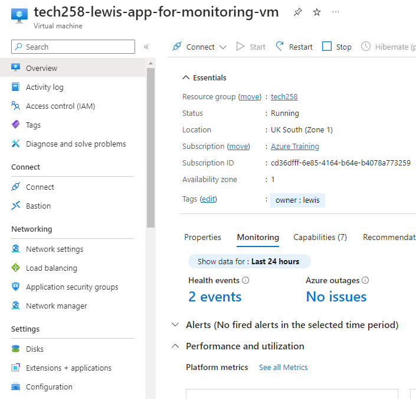

Here you can scroll down and see the default monitoring graphs to show you information about your app.

If you select the pin icon on any of those graphs you can add them to your dashboard.

Here you have the option to create a new dashboard, use a previous one and make it private or shared.

Once it's been created you can add more of the graphs to it, use the edit button to move them around or change their size and click into the individual graphs to edit them further such as changing time ranges.

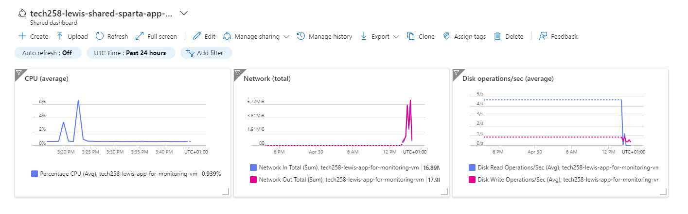

### Setting up Alerts

Here we are going to setup an example alert for our app.

#### Step 1.

You first need to make sure your app vm is running and is working as you would expect.

Navigate your way over to the over to your virtual machine portal page on Azure.

If you scroll down on the left hand menu you will see an option that says alerts. If you click on that option you will now see the create new button which you should now click then proceed to click alert rule.

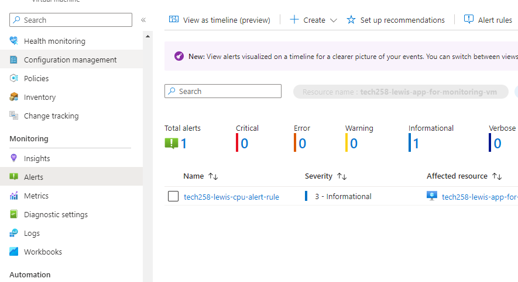

#### Step 2.

Select your signal, this means what area are you looking to monitor. In our case it's the CPU usage.

We want to set out alert for maximum aggregation type as we are looking at the max value and great than the number we are looking to be alerted to. In this example anything over 3% CPU usage will alert us.

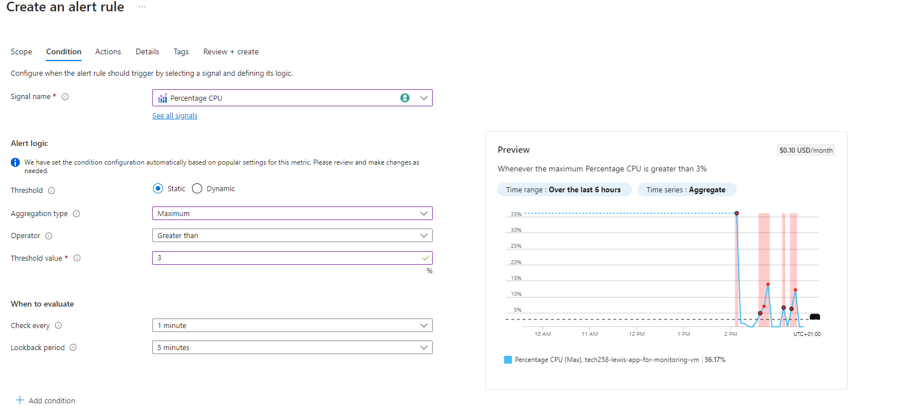

#### Step 3.

Now you want to set an action group to group this rule into for later use. Give the action a sensible display name. Finally add the email you want the notification sent to if the alert is triggered.

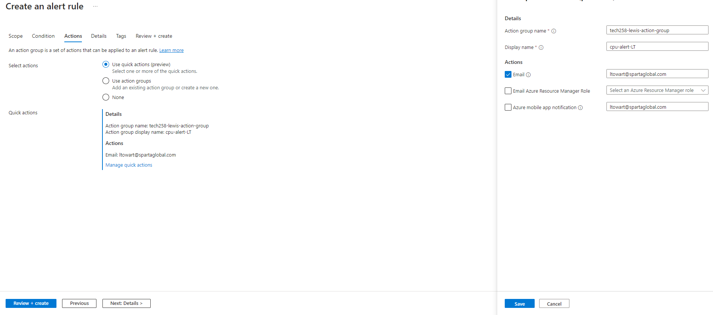

You can move over to the details tab to add some additional info and give the alert rule a sensible name.

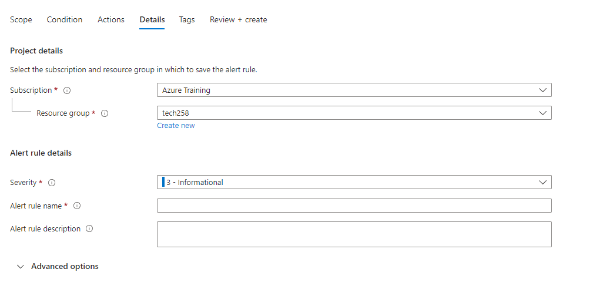

Don't forget to add the usual owner and name tags.

### Testing Your Alert

First you want to ssh into your app vm.

Next you are going to install apache which allows you to use commands for benchmarking you app.

```
sudo apt-get install apache2-utils
```

Then you can run any of the below commands to start stress testing the CPU.

```
ab -n 1000 -c 100 http://20.90.163.7/
ab -n 10000 -c 200 http://20.90.163.7/
ab -n 20000 -c 300 http://20.90.163.7/
ab -n 40000 -c 300 http://20.90.163.7/
```
In this command n is total number of request and the c is how many it will send at once.

You can check how this is going by looking at your dashboard.

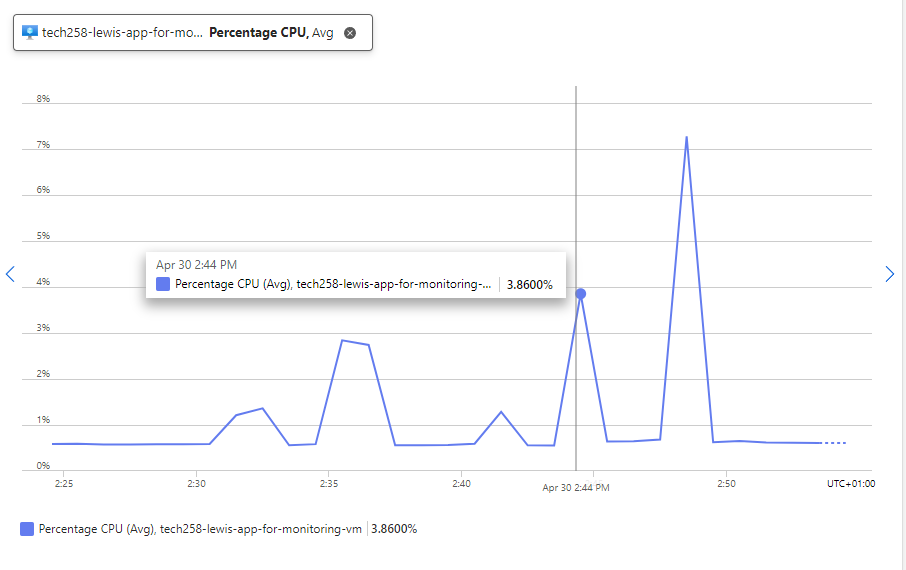

Now your alert should have been triggered. To confirm this you will receive an email similar to the one below.

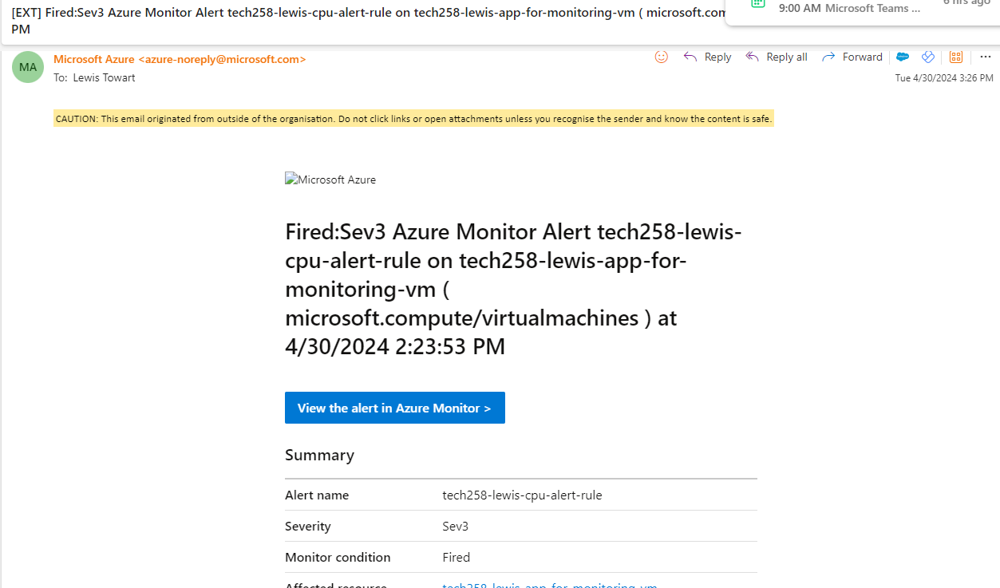

You can also go to the alerts section on your app vm and should see that it has been fired.

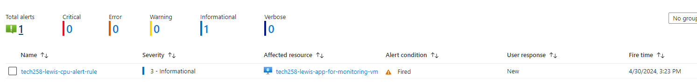

If the CPU in this case returns to a normal value less than earlier specified you will also be notified.

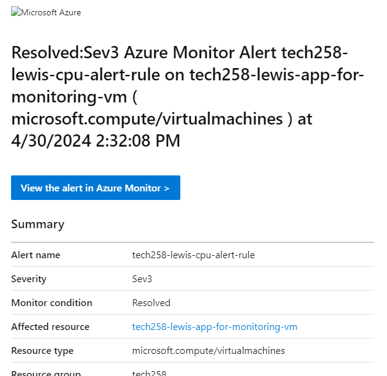

#### Testing for Autoscaling

These steps can be a fantastic way to test you instance to see what times it may be reaching a CPU load that is detrimental to the user experience or what exact percentage that would be.

I could continue by using Apache to test at what point the app instance stops working all together or at what percentage CPU load causes the app page to load slowly. These are all aspects that need to be tested to ensure the best user experience.

I can then use these numbers within my Azure scale set to make sure that before we reach the point of the user experience worsening I can set a value that if the average were exceeded a new app VM would be created.


