# Security

## VPC

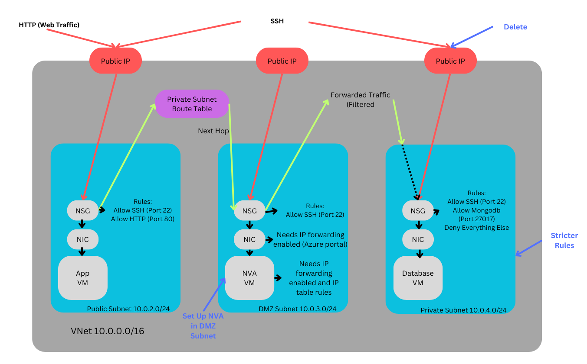

DMZ de-militarised zone
NVA - Network Virtual Appliance

We currently have two VMs one for the database and one for the app. We are going to make the database more private and secure. The app and database are each inside their own subnet. The app is part of the public subnet and the database is part of the private subnet both within our virtual network.

subnet ip from 0 to 255

Public as set to 10.0.2.0/24
Private as set to 10.0.3.0/24

We are going to make a private subnet as 10.0.4.0/24.

Both our app and database have a couple of security elements currently. One is the network security groups and the other is the network interface card which is responsible for all communications going in and out.

We have a public address people use to access our virtual machines. Web traffic traffic coming from HTTP port 80. We can access them by ssh into them through their public IPs. Both internal and external traffic go through the network security group.

A network security group has rules, it needs to allow http port 80 and ssh port 22 traffic for the app. For the database we only need to allow ssh traffic.

We are going to make stricter rules for our database network security group. We are going to only allow mongodb traffic. The lower the rule priority the higher that priority is. Could do ssh 100 mongodb 101 and a rule to deny everything else.

We are also going to create the DMZ subnet. App currently communicates to the database then the database back to the app to create the posts information. We are going to make 10.0.3.0/24 our dmz subnet. 

Inside this dmz subnet we are going to need to create a vm for a network virtual appliance. At least initially we need ssh to test and configure, can remove it when it's all been set up. It will have a public ip associated so we can ssh.

We are creating this as a form of filter or firewall. We need to make sure all database requests can only go to the database vm. This will make sure that the only traffic is coming from the right source so our app/public subnet is going to be allowed to talk to the database/private subnet. We are forcing traffic through this NVA.

All our devices can currently talk to each other. Routing is referencing the path traffic can take. We want traffic from the app to go to the database via the nva. For this we need a route table "to private subnet route table". This means traffic from the app vm will use this table so it knows to let traffic go to the nva as the next hop. After the route the next place the traffic can go is next hop. Now if the traffic is from the right source our nva will forward the traffic on to the database/private subnet, this is forwarded traffic (been filtered).

If set up correctly nothing can access our database from the outside.

Our network security interface needs IP forwarding enabled on Azure portal. IP forwarding also needs to be enabled on the linux OS on our NVA VM. We are going to use IP table for our firewall settings in linux on our NVA.

color for things such as safe traffic and potentially not safe. route from app to nva to db is safe so green. Unsafe to public ip is unsafe

## Setting up Secure Architecture

### Step 1.

First we need to create a new virtual network that will contain our 3 subnets needed for the App, NVA and Database.

Start by searching for virtual network and select that option

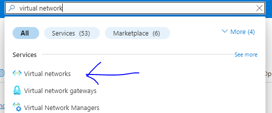

Now click on create

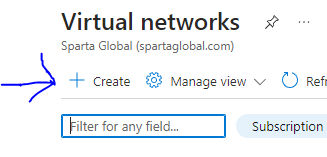

Next we need to name the new VNet something sensible and select the correct region.

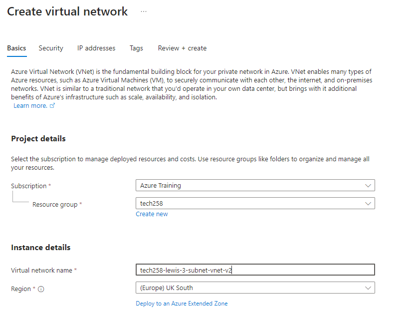

Here we are going to start by editing the default subnet.

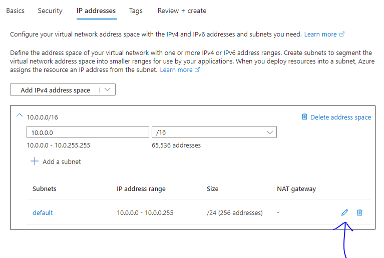

Add the settings in the pic below

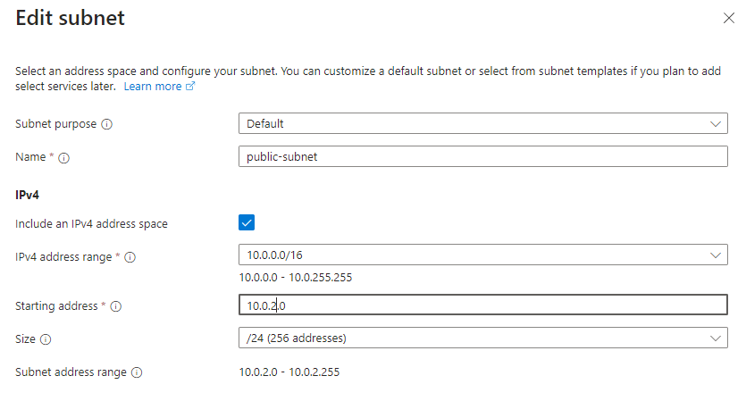

Now we need to add another subnet for our DMZ.

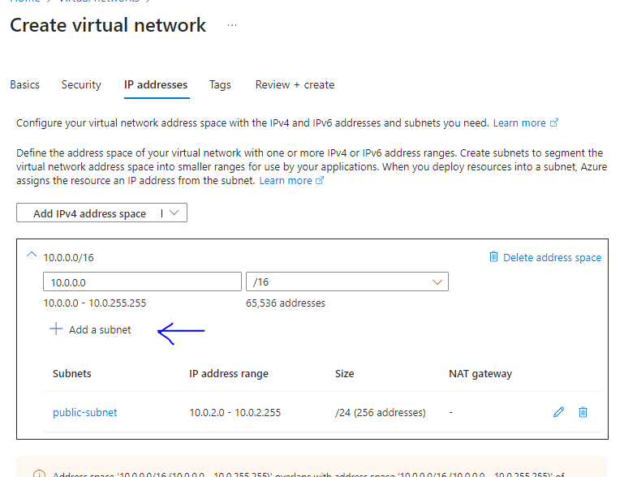

Below are the settings for the DMZ.

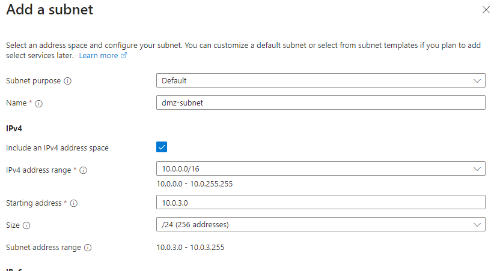

Now again click on add new subnet and this time we are making the private subnet with the settings below. notice box ticked.

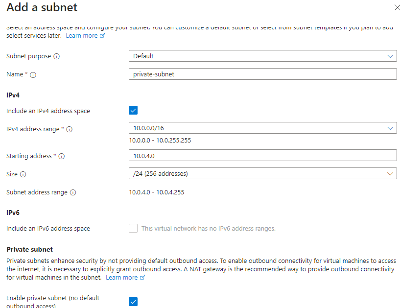

Now add you tags and then review the details, click create when you are happy.

### Step 2.

Now we need to launch our database from our custom image we have previously created.

Start by searching for images.

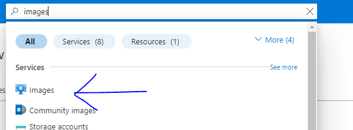

Now use the search filed to find the custom database image

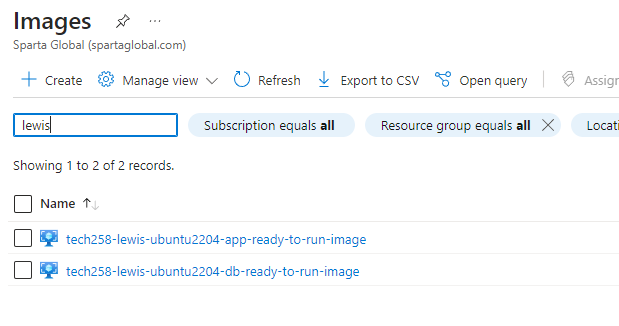

Now carry on and select create new VM

Here you want to make sure to select zone 3 for the database and name it sensibly.

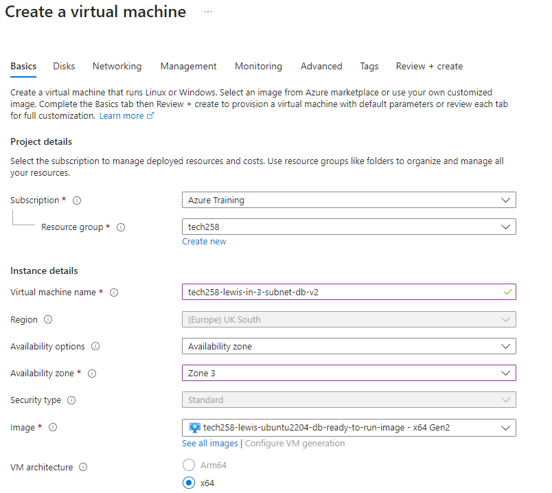

Next make sure it is standard B1, add the paired keys we setup previously and select liscense other.

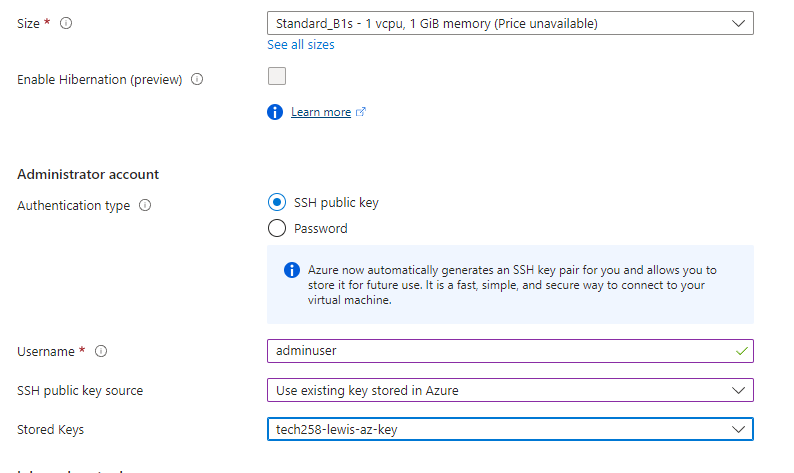

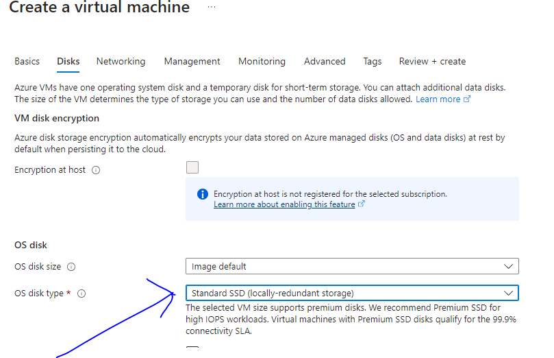

For the network settings select priv ip no pub ip and allow ssh for now

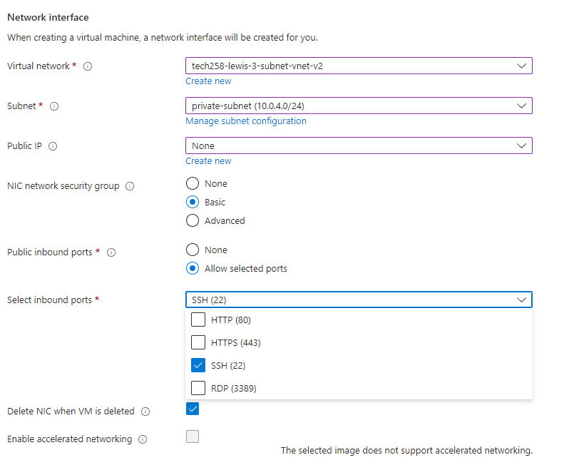

Sets tages, review, create

### Step 3.

searhc image sleect app

Now we need to name our app and launch it in zone 1

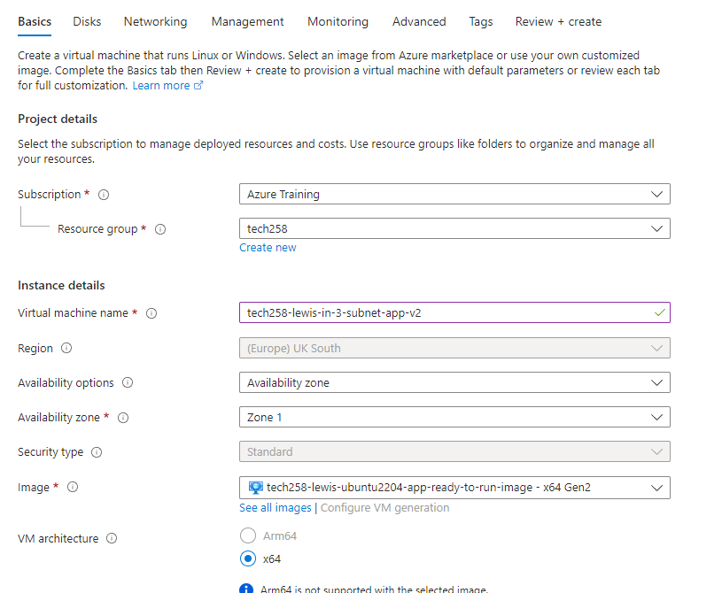

same as before size ssh key standrd disk.

Here in the network settings we want it as below pic

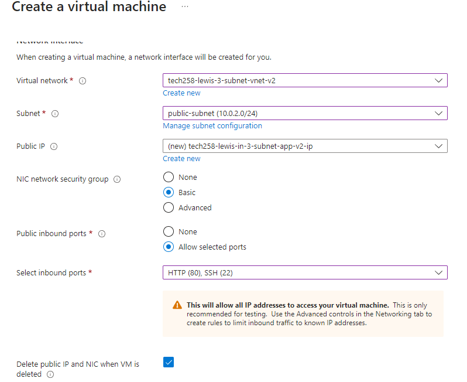

now we want user data check ip

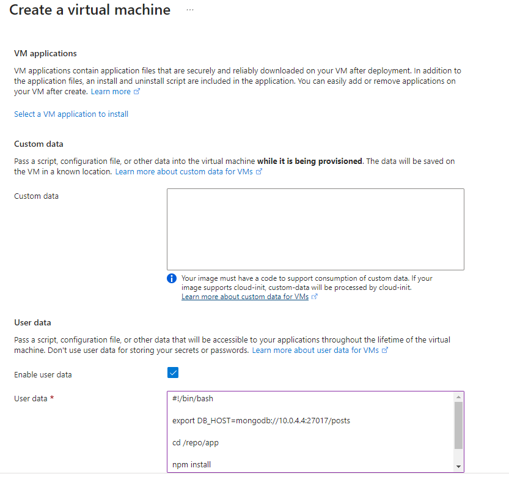

tags review create

can check by going posts page.

### Step 4.

Here we are now going to create a new vitural machine. Similar to before search virtual machine select that option. Then select create.

Now set out the options as below and add zone 2.

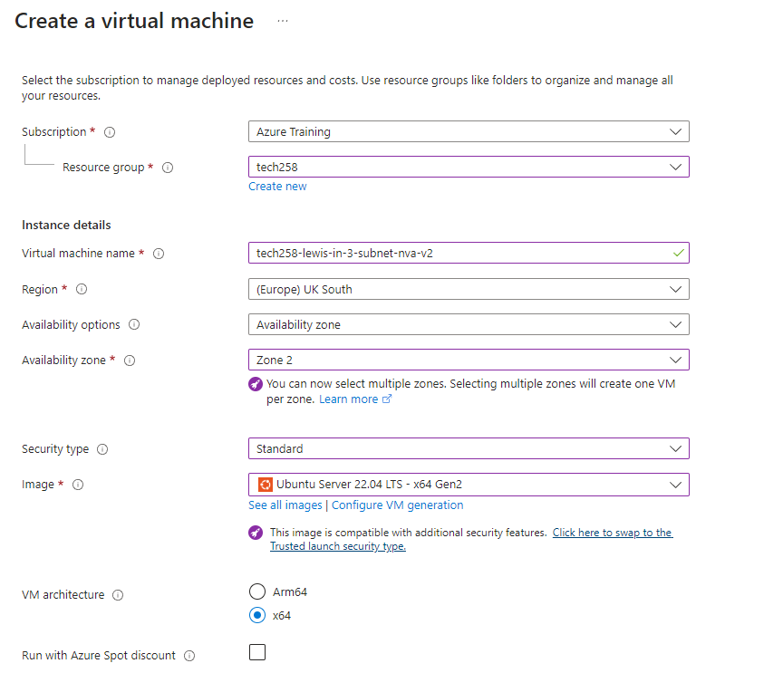

ssh keys standard and disk

Now we need to ste the dmz network

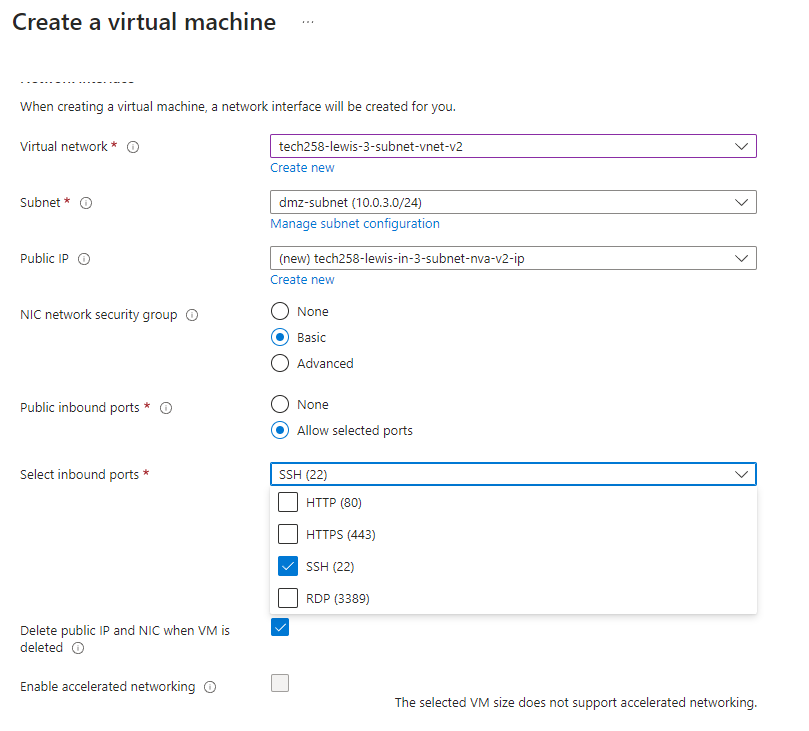

set tags and create

### Step 5.

We want to ssh into our app vm to see how packages are being sent to the database. we can use the ping command.

```
ping "database private ip"
```

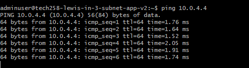

### Step 6.

Here we are going to set a route table similar to before search for route tables on the zure protal slecte that option and now click create.

name as follows

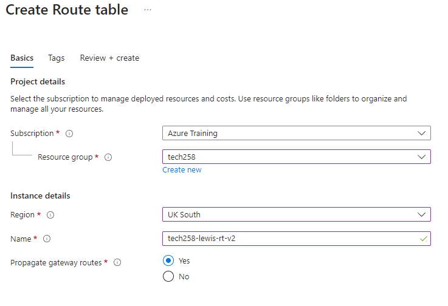

Wait for it to deploy and go to the resource. now go to the routes section and select add

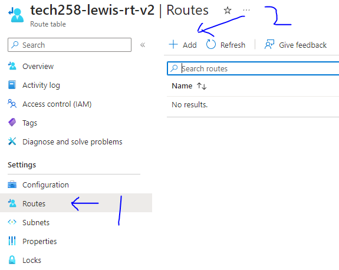

Name as below and copy the settings. ip to priavte sub net and hop to the private ip to nva

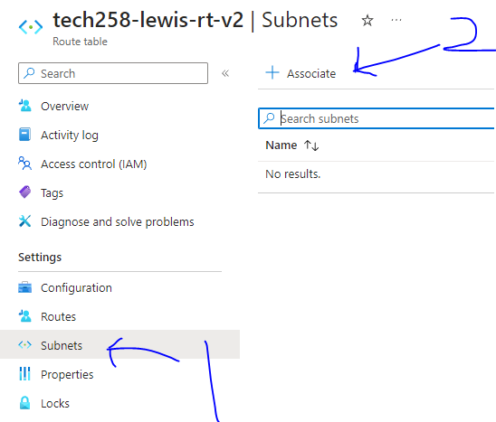

Now go to subnets and assoicate the pun subnet

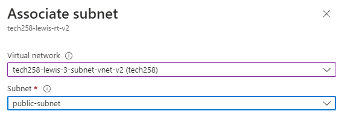

### Step 7.

Now we need the nva azure portal to forward ip so go here

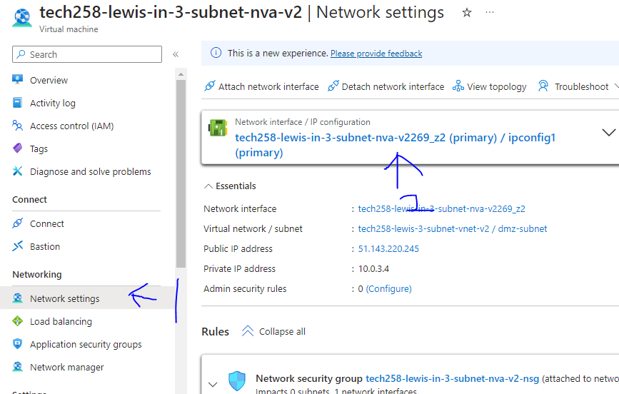

now just tick the box

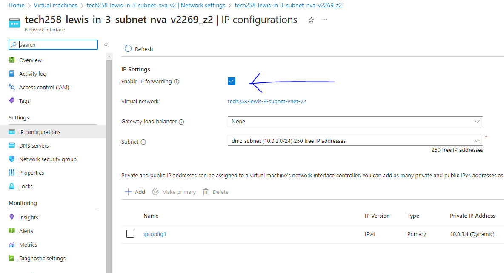

we now need to set the forwarding of ips on the nva vm, so ssh in.

can use command to check

```
sysctl net.ipv4.ip_forward
```

Before we do anything else we need to update and upgrade using the commands below one at a time.

```
sudo apt update
sudo apt upgrade
```

Now we need to use the below command to access the config file and comment in the line shown in the picture below. Make sure to save the file.

```
sudo nano /etc/sysctl.conf
```

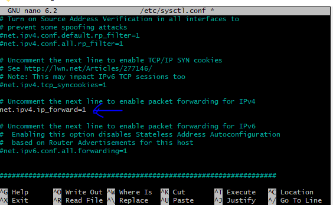

Now we need that file to be reloaded for the change to take place, to do this we need to run the below command.

```
sudo sysctl -p
```

The response should be net.ipv4.ip_forward = 1

### Step 8.

We now need to set the rules for out ip table.

Use the command below to create a new script file

```
nano ip--table-config.sh
```

Now past the below script into this new file.

```
#!/bin/bash
 
# configure iptables
 
echo "Configuring iptables..."
 
# ADD COMMENT ABOUT WHAT THE FOLLOWING COMMAND(S) DO
sudo iptables -A INPUT -i lo -j ACCEPT
sudo iptables -A OUTPUT -o lo -j ACCEPT
 
# ADD COMMENT ABOUT WHAT THE FOLLOWING COMMAND(S) DO
sudo iptables -A INPUT -m state --state ESTABLISHED,RELATED -j ACCEPT
 
# ADD COMMENT ABOUT WHAT THE FOLLOWING COMMAND(S) DO
sudo iptables -A OUTPUT -m state --state ESTABLISHED -j ACCEPT
 
# ADD COMMENT ABOUT WHAT THE FOLLOWING COMMAND(S) DO
sudo iptables -A INPUT -m state --state INVALID -j DROP
 
# ADD COMMENT ABOUT WHAT THE FOLLOWING COMMAND(S) DO
sudo iptables -A INPUT -p tcp --dport 22 -m state --state NEW,ESTABLISHED -j ACCEPT
sudo iptables -A OUTPUT -p tcp --sport 22 -m state --state ESTABLISHED -j ACCEPT
 
# uncomment the following lines if want allow SSH into NVA only through the public subnet (app VM as a jumpbox)
# this must be done once the NVA's public IP address is removed
#sudo iptables -A INPUT -p tcp -s 10.0.2.0/24 --dport 22 -m state --state NEW,ESTABLISHED -j ACCEPT
#sudo iptables -A OUTPUT -p tcp --sport 22 -m state --state ESTABLISHED -j ACCEPT
 
# uncomment the following lines if want allow SSH to other servers using the NVA as a jumpbox
# if need to make outgoing SSH connections with other servers from NVA
#sudo iptables -A OUTPUT -p tcp --dport 22 -m conntrack --ctstate NEW,ESTABLISHED -j ACCEPT
#sudo iptables -A INPUT -p tcp --sport 22 -m conntrack --ctstate ESTABLISHED -j ACCEPT
 
# ADD COMMENT ABOUT WHAT THE FOLLOWING COMMAND(S) DO
sudo iptables -A FORWARD -p tcp -s 10.0.2.0/24 -d 10.0.4.0/24 --destination-port 27017 -m tcp -j ACCEPT
 
# ADD COMMENT ABOUT WHAT THE FOLLOWING COMMAND(S) DO
sudo iptables -A FORWARD -p icmp -s 10.0.2.0/24 -d 10.0.4.0/24 -m state --state NEW,ESTABLISHED -j ACCEPT
 
# ADD COMMENT ABOUT WHAT THE FOLLOWING COMMAND(S) DO
sudo iptables -P INPUT DROP
 
# ADD COMMENT ABOUT WHAT THE FOLLOWING COMMAND(S) DO
sudo iptables -P FORWARD DROP
 
echo "Done!"
echo ""
 
# make iptables rules persistent
# it will ask for user input by default
 
echo "Make iptables rules persistent..."
sudo DEBIAN_FRONTEND=noninteractive apt install iptables-persistent -y
echo "Done!"
echo ""
```

Now we need to run this script, I like to use the command below

```
bash ip-table-config-sh
```

You can check to see if your posts page is still working which it should be and if you're still ssh'd into you app the ping should be running again.


