- [Creating a VPC](#creating-a-vpc)
  - [Setting up Secure Architecture](#setting-up-secure-architecture)
    - [Step 1.](#step-1)
    - [Step 2.](#step-2)
    - [Step 3.](#step-3)
    - [Step 4.](#step-4)
    - [Step 5.](#step-5)
    - [Step 6.](#step-6)
    - [Step 7.](#step-7)
    - [Step 8.](#step-8)
  - [Detailed Explanation of the IP Table Script](#detailed-explanation-of-the-ip-table-script)

# Creating a VPC

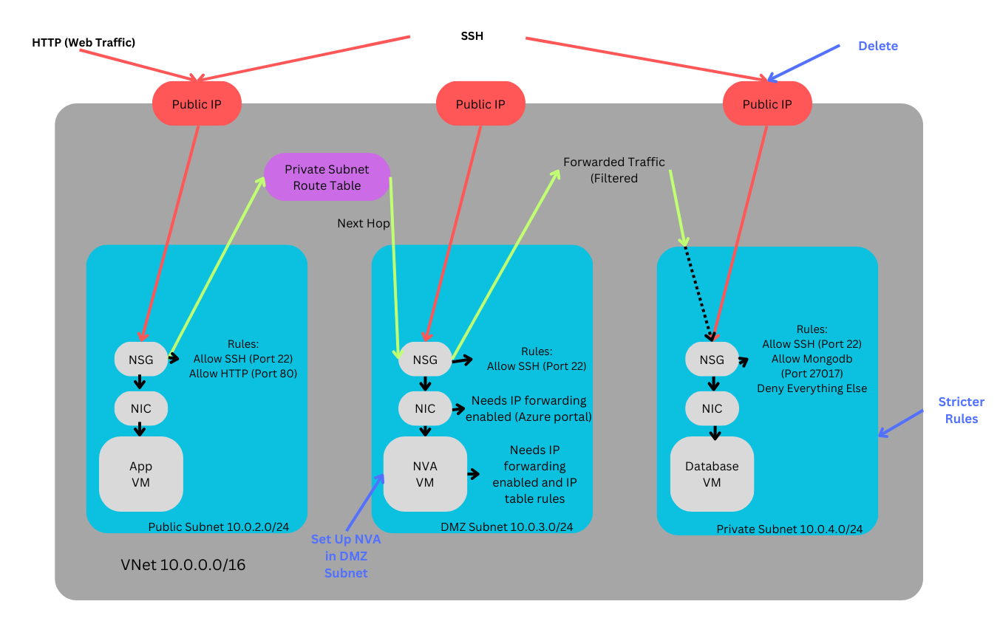

DMZ - Demilitarized Zone

NVA - Network Virtual Appliance

We currently have two VMs one for the database and one for the app. We are going to make the database more private and secure. The app and database are each inside their own subnet. The app is part of the public subnet and the database is part of the private subnet both within our virtual network.

subnet ip from 0 to 255

Both our app and database have a couple of security elements currently. One is the network security groups and the other is the network interface card which is responsible for all communications going in and out.

We have a public address people use to access our virtual machines. Web traffic traffic coming from HTTP port 80. We can access them by ssh into them through their public IPs. Both internal and external traffic go through the network security group.

A network security group has rules, it needs to allow http port 80 and ssh port 22 traffic for the app. For the database we only need to allow ssh traffic.

We are going to make stricter rules for our database network security group. We are going to only allow mongodb traffic. The lower the rule priority the higher that priority is. Could do ssh then mongodb and then a rule to deny everything else to make sure the subnet doesn't deny ssh and mongodb traffic.

We are also going to create the DMZ subnet. App currently communicates to the database then the database back to the app to create the posts information. We are going to make 10.0.3.0/24 our dmz subnet. 

Inside this dmz subnet we are going to need to create a vm for a network virtual appliance. At least initially we need ssh to test and configure, can remove it when it's all been set up. It will have a public ip associated so we can ssh.

We are creating this as a form of filter or firewall. We need to make sure all database requests can only go to the database vm. This will make sure that the only traffic is coming from the right source so our app/public subnet is going to be allowed to talk to the database/private subnet. We are forcing traffic through this NVA.

All our devices can currently talk to each other. Routing is referencing the path traffic can take. We want traffic from the app to go to the database via the nva. For this we need a route table "to private subnet route table". This means traffic from the app vm will use this table so it knows to let traffic go to the nva as the next hop. After the route the next place the traffic can go is next hop. Now if the traffic is from the right source our nva will forward the traffic on to the database/private subnet, this is forwarded traffic (been filtered).

If set up correctly nothing can access our database from the outside.

Our network security interface needs IP forwarding enabled on Azure portal. IP forwarding also needs to be enabled on the linux OS on our NVA VM. We are going to use IP table for our firewall settings in linux on our NVA.

## Setting up Secure Architecture

### Step 1.

First we need to create a new virtual network that will contain our 3 subnets needed for the App, NVA and Database.

Start by searching for virtual network and select that option

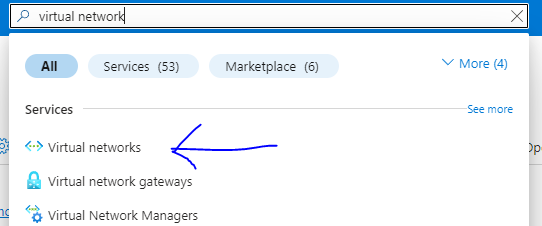

Now click on create


Next we need to name the new VNet something sensible and select the correct region.


Here we are going to start by editing the default subnet.

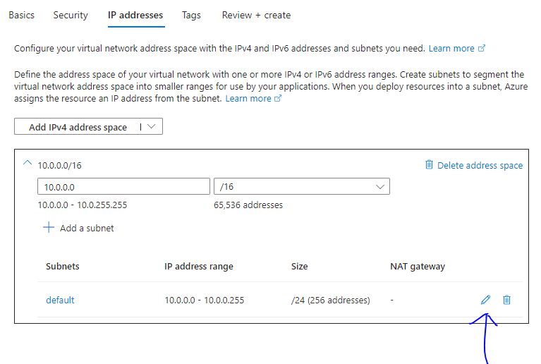

Add the settings in the picture below. We are naming it our public-subnet and inputting a starting address.


Now we need to add another subnet for our DMZ.

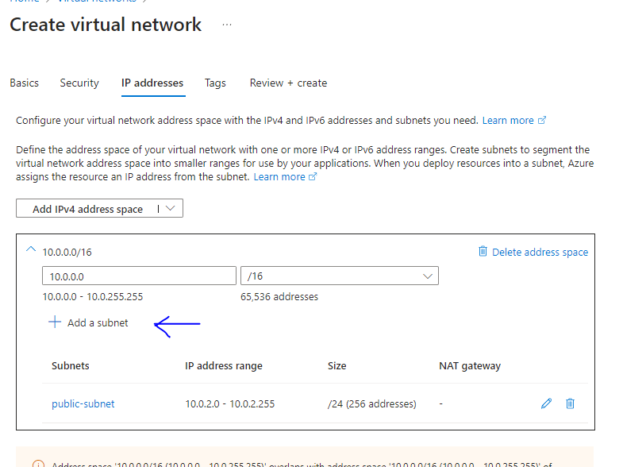

Below are the settings for the DMZ. Similar to the public one we are naming it dmz-subnet and adding the starting address.


Now again click on add new subnet and this time we are making the private subnet with the settings below. Notice for this one we are ticking the box enable private subnet. This is stopping any outbound requests such as internet use.


Now add your tags, review the details and click create when you are happy.

### Step 2.

Now we need to launch our database from our custom image we have previously created.

Start by searching for images.

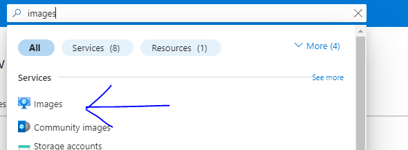

Now use the search to find the custom database image.


Once you have selected the image, click on create new.

Here you want to make sure to select zone 3 for the database and name it sensibly. We are placing them in different zones so that if one were to go down it doesn't take all of our instances with it just the one on that zone.


Next make sure it is standard B1, you have added the paired keys we setup previously and select license other.


For the network settings select private ip but this time with no public ip. Make sure to allow ssh for now in case we need to update anything, we don't want this option in the future for increased security.

We are removing the need for a public IP as we don't want any traffic going to our database that hasn't passed our new NVA filter.

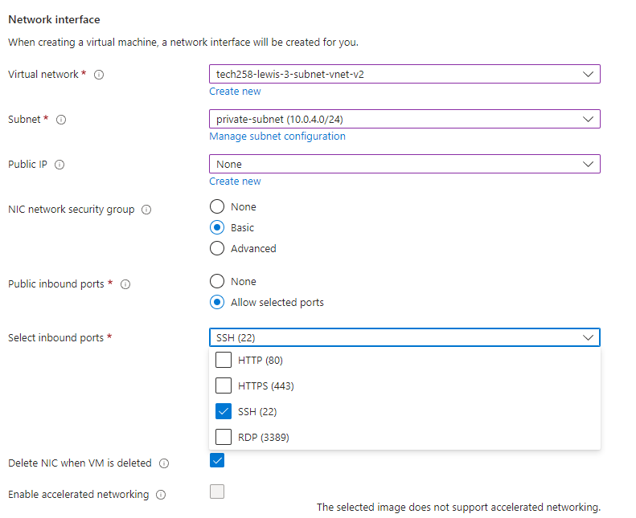

Don't forget to set your own tags, review your settings and when you're confident select create.

### Step 3.

Just like before we are going to search for images but this time select our app and launch a new VM.

Now we need to name our app something sensible and launch it in Zone 1.


same as the instance before we need to select the right size, use our previous ssh keys and select license other.

Here in the network settings we want it as below picture. We are selecting our public-subnet and allowing http and ssh traffic.


Now we want to add out user data to get the app running and make the link to the database. Make sure to double check the private IP hasn't changed for the Database to use in DB_HOST environment variable.


As always make sure to set the owner tag, review your settings and select create when you are confident.

You can check everything has been set up correctly by using the app public IP and going to the posts page.

### Step 4.

Here we are now going to create a new virtual machine. Similar to before search virtual machine select that option. Then select create.

Now set out the options as below making sure to note the marketplace image of Ubuntu 22.04 and adding availability zone 2.

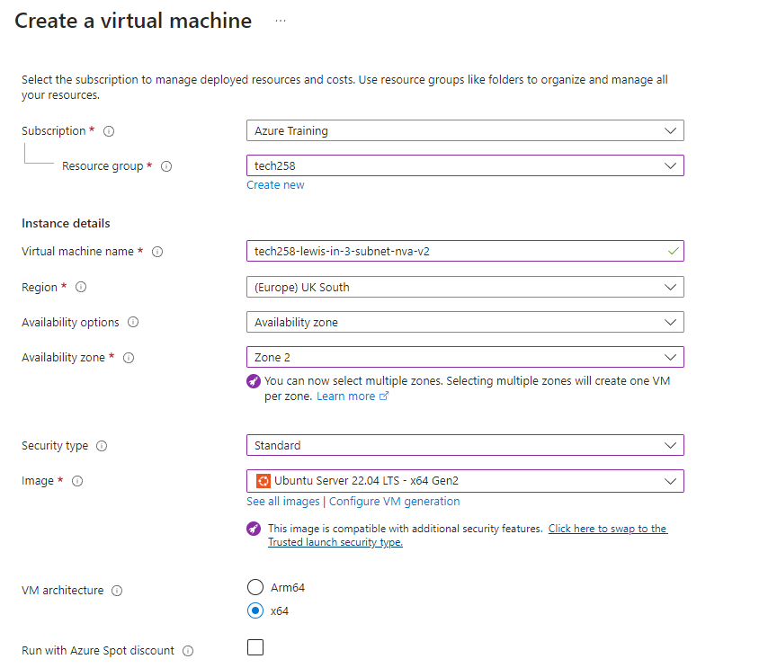

As before select our paired ssh keys, the correct size standard-B1 and this time with a new virtual machine select security type standard.

Now we need to set up our DMZ subnet. So select DMZ subnet and allow shh, this is because we are going to need to access our NVA instance to setup IP forwarding.

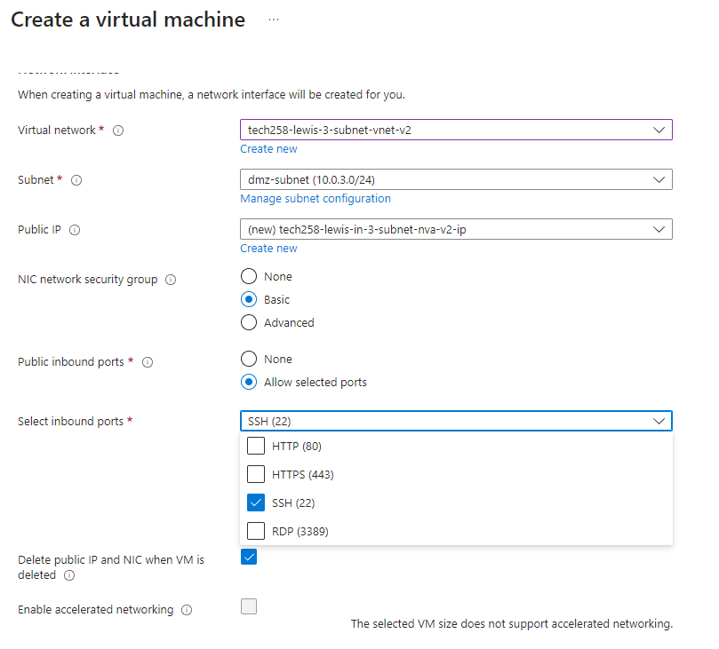

As before don't forget to set your tags up with the owner and your name then when you have review your current setup select create.

### Step 5.

We want to ssh into our app vm to see if packages are being sent to the database. The below command send packages to the database to make sure that it is receiving them.

```
ping "database private ip"
```

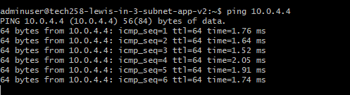

### Step 6.

Here we are going to set a route table similar to before search for route tables on the Azure portal, select that option and now click create.

Follow our usual naming convention as seen below.


Wait for it to deploy and go to the resource. Now go to the routes section and select add.


Name as below and copy the settings. We want our destination IP to be the private subnet as this is our final stop for our traffic and hop to the private IP of the NVA VM as this is where we want out traffic o be filtered through.


Now go to the subnets option as seen in the image below and click associate.


Next we want to associate with our public subnet where our app is located.

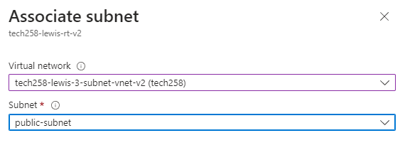

### Step 7.

Now we need the NIC for the NVA on the Azure portal to allow IP forwarding so now follow the steps in the picture below.


Here we are going to just tick the box that says IP forwarding.

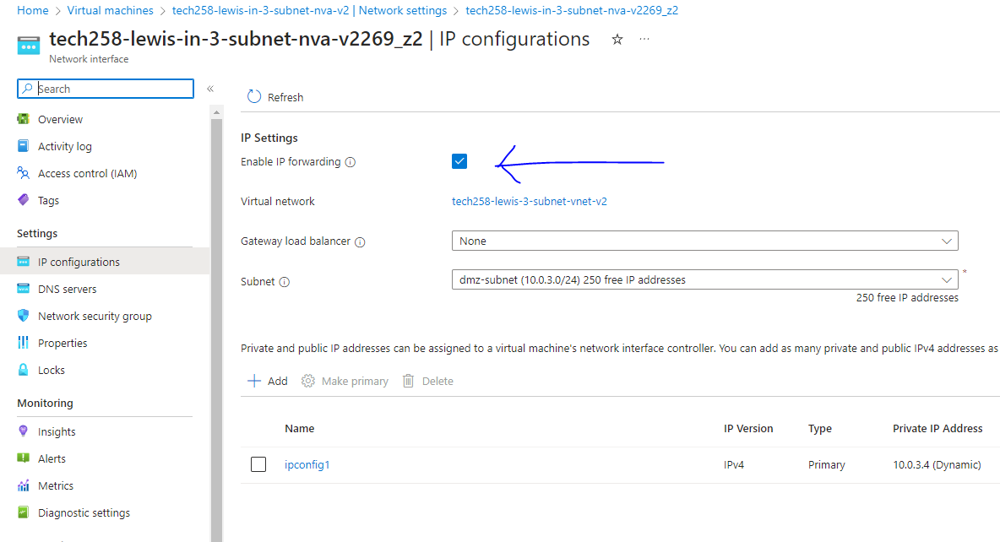

We now need to enable IP forwarding on the NVA VM, so we are going to ssh in now.

You can use the below command to check if IP forwarding is enabled. 0 means that it is not enabled the value should be 1 but not at this point as we having set it yet.

```
sysctl net.ipv4.ip_forward
```

Before we do anything else we need to update and upgrade using the commands below one at a time.

```
sudo apt update
sudo apt upgrade
```

Now we need to use the below command to access the config file and comment in the line shown in the picture below. Make sure to save the file.

```
sudo nano /etc/sysctl.conf
```

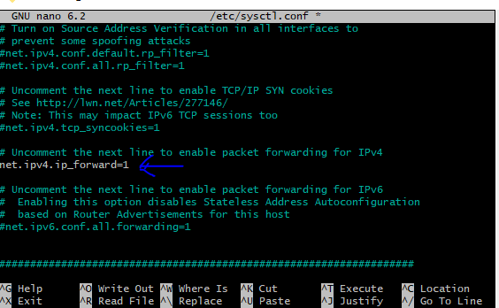

Now we need that file to be reloaded for the change to take place, to do this we need to run the below command.

```
sudo sysctl -p
```

The response should be net.ipv4.ip_forward = 1

### Step 8.

We now need to set the rules for out ip table.

Use the command below to create a new script file

```
nano ip--table-config.sh
```

Now past the below script into this new file.

```
#!/bin/bash
 
# configure iptables
 
echo "Configuring iptables..."
 
# Allow all traffic on the loopback interface for incoming traffic
sudo iptables -A INPUT -i lo -j ACCEPT
# Allow all traffic on the loopback interface for outgoing traffic
sudo iptables -A OUTPUT -o lo -j ACCEPT

# Allow incoming traffic that is part of established or related connections
sudo iptables -A INPUT -m state --state ESTABLISHED,RELATED -j ACCEPT

# Allow outgoing traffic that is part of established connections
sudo iptables -A OUTPUT -m state --state ESTABLISHED -j ACCEPT

# Drop incoming traffic that is invalid or not part of any established connection
sudo iptables -A INPUT -m state --state INVALID -j DROP

# Allow incoming SSH traffic for new and established connections
sudo iptables -A INPUT -p tcp --dport 22 -m state --state NEW,ESTABLISHED -j ACCEPT
# Allow outgoing SSH traffic for established connections
sudo iptables -A OUTPUT -p tcp --sport 22 -m state --state ESTABLISHED -j ACCEPT

# Allow forwarding of TCP traffic from source subnet to destination subnet on port 27017
sudo iptables -A FORWARD -p tcp -s 10.0.2.0/24 -d 10.0.4.0/24 --destination-port 27017 -m tcp -j ACCEPT

# Allow forwarding of ICMP (ping) traffic from source subnet to destination subnet for new and established connections
sudo iptables -A FORWARD -p icmp -s 10.0.2.0/24 -d 10.0.4.0/24 -m state --state NEW,ESTABLISHED -j ACCEPT

# Set default policy to drop all incoming traffic
sudo iptables -P INPUT DROP

# Set default policy to drop all forwarded traffic
sudo iptables -P FORWARD DROP

echo "Done!"
echo ""
 
# make iptables rules persistent
# it will ask for user input by default
 
echo "Make iptables rules persistent..."
sudo DEBIAN_FRONTEND=noninteractive apt install iptables-persistent -y
echo "Done!"
echo ""
```

Now we need to run this script, I like to use the command below

```
bash ip-table-config.sh
```

You can check to see if your posts page is still working which it should be and if you're still ssh'd into you app the ping should be running again.

## Detailed Explanation of the IP Table Script

```
# Allow all traffic on the loopback interface for incoming traffic
sudo iptables -A INPUT -i lo -j ACCEPT
```
This command allows all incoming traffic on the loopback interface (`lo`). The loopback interface is a virtual network interface within a computer system that *allows communication between different processes running on the same computer* . It is commonly used for internal communications and network testing. All traffic sent to the loopback interface stays within the system and is not transmitted over any physical network. Talk to the machine you're on from the machine.

```
# Allow all traffic on the loopback interface for outgoing traffic
sudo iptables -A OUTPUT -o lo -j ACCEPT
```
This command allows all outgoing traffic on the loopback interface (`lo`). Similar to the previous command, it enables communication between different processes running on the same system.

```
# Allow incoming traffic that is part of established or related connections
sudo iptables -A INPUT -m state --state ESTABLISHED,RELATED -j ACCEPT
```
This command allows incoming traffic that is part of established or related connections. Established connections are those that have already been initiated and are ongoing. Related connections are those that are related to established connections, such as FTP data connections related to an FTP control connection.

```
# Allow outgoing traffic that is part of established connections
sudo iptables -A OUTPUT -m state --state ESTABLISHED -j ACCEPT
```
This command allows outgoing traffic that is part of established connections. It ensures that responses to outgoing requests (e.g., web pages requested by a web browser) are allowed to return to the system.

```
# Drop incoming traffic that is invalid or not part of any established connection
sudo iptables -A INPUT -m state --state INVALID -j DROP
```
This command drops incoming traffic that is invalid packets or not part of any established connection. Invalid packets are those that do not conform to the expected network protocol standards or are otherwise malformed. Dropping such packets helps protect the system from potential attacks or misconfigurations.

```
# Allow incoming SSH traffic for new and established connections
sudo iptables -A INPUT -p tcp --dport 22 -m state --state NEW,ESTABLISHED -j ACCEPT
# Allow outgoing SSH traffic for established connections
sudo iptables -A OUTPUT -p tcp --sport 22 -m state --state ESTABLISHED -j ACCEPT
```
These commands allow incoming SSH (Secure Shell) traffic for new and established connections on port 22. SSH is a network protocol used for secure remote access to systems. The first command allows incoming SSH traffic, while the second command allows outgoing SSH traffic. Both commands specify the use of the TCP protocol and match packets based on their source or destination port and connection state.

```
# Allow forwarding of TCP traffic from source subnet to destination subnet on port 27017
sudo iptables -A FORWARD -p tcp -s 10.0.2.0/24 -d 10.0.4.0/24 --destination-port 27017 -m tcp -j ACCEPT
```
This command allows forwarding of TCP traffic from a source subnet (`10.0.2.0/24`) to a destination subnet (`10.0.4.0/24`) on port 27017. It is commonly used in network configurations to allow specific types of traffic between different subnets or network segments. Allowing Mongodb requests to move between the machines.

```
# Allow forwarding of ICMP (ping) traffic from source subnet to destination subnet for new and established connections
sudo iptables -A FORWARD -p icmp -s 10.0.2.0/24 -d 10.0.4.0/24 -m state --state NEW,ESTABLISHED -j ACCEPT
```
This command allows forwarding of ICMP (Internet Control Message Protocol) traffic, commonly used for *ping requests* , from a source subnet to a destination subnet for new and established connections. ICMP is used for various network diagnostic tasks, including testing the reachability of a host and measuring round-trip times.

```
# Set default policy to drop all incoming traffic
sudo iptables -P INPUT DROP
```
This command sets the default policy for the INPUT chain to *drop all incoming traffic that does not match any of the preceding rules* . It provides a default level of security by blocking all incoming connections unless explicitly allowed by specific rules.

```
# Set default policy to drop all forwarded traffic
sudo iptables -P FORWARD DROP
```
This command sets the default policy for the FORWARD chain to drop all forwarded traffic that does not match any of the preceding rules. It helps prevent unauthorized or malicious traffic from being forwarded between different network segments.


